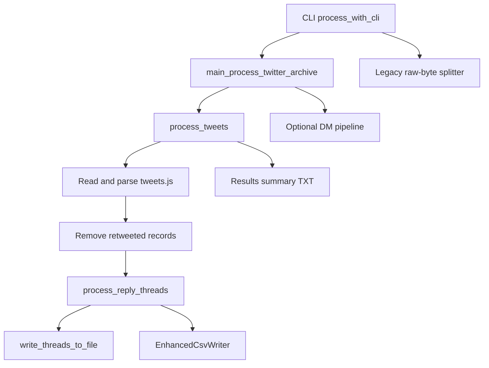
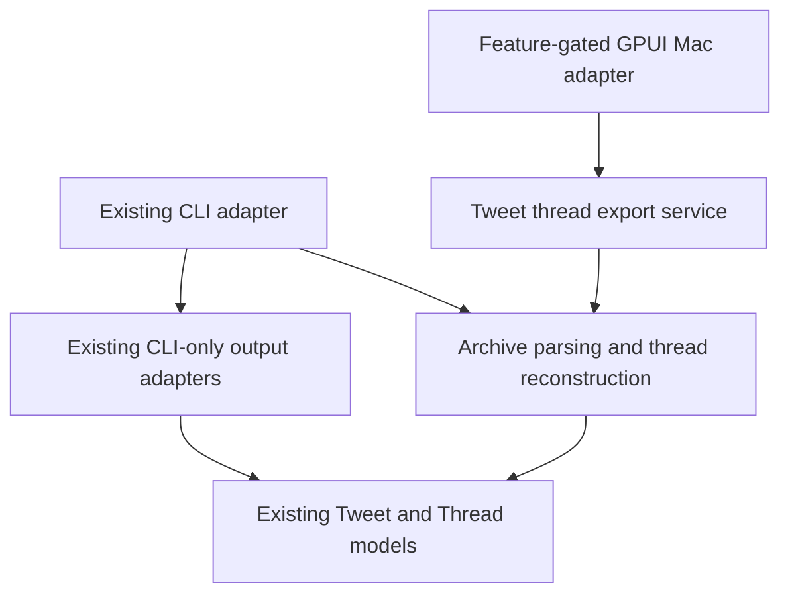
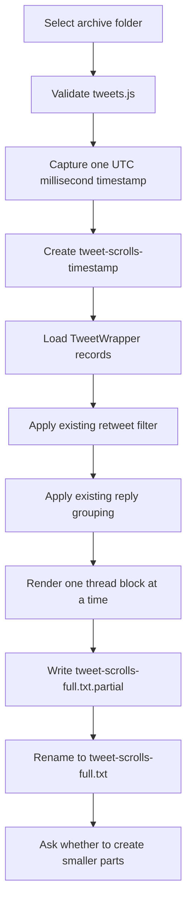
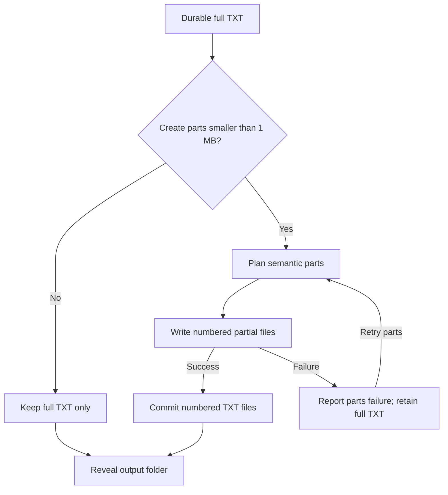
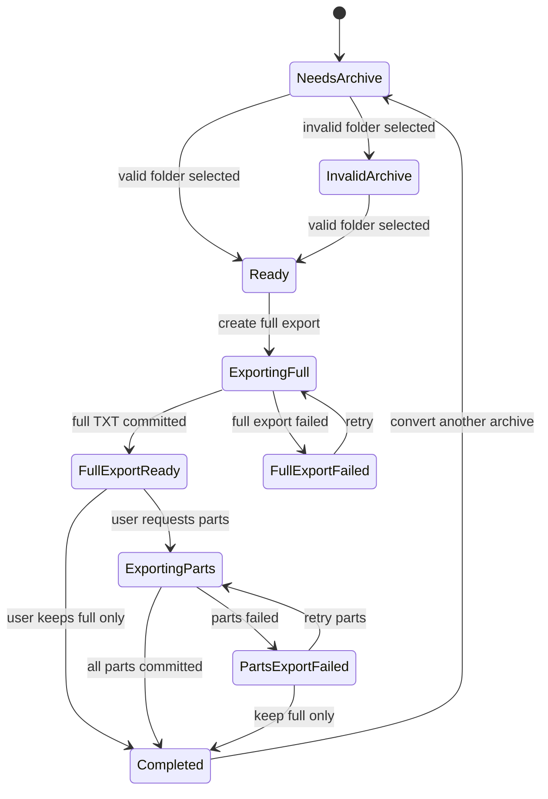

# LLM-ready Tweet Thread Exporter — GPUI Architecture

**Status:** Accepted architecture
**Date:** 2026-08-12
**Branch:** `Aug-12-01`
**Decision:** Extract a shared tweet-thread core; retain the existing CLI as one adapter and add a TXT-only GPUI macOS adapter.
**Product version:** v0.0.2

This document is the architectural source of truth for the simplified v0.0.2 product. It supersedes the broader DM, CSV, and automatic byte-splitting assumptions in [the earlier PRD](./2026-08-12-same-cli-but-zedgpui-ui-prd.md). The executable specification should be derived from this architecture.

## Architectural thesis

Build one trustworthy thread-extraction core and expose it through two deliberately different adapters:

- The existing CLI keeps its command syntax and current artifact behavior.
- The GPUI Mac app creates LLM-ready TXT only: one complete export first, followed by an optional set of parts smaller than 1 MB.

Sharing the semantic core does not require the two surfaces to produce identical artifact sets. It requires them to agree about which tweets belong to which thread.

## v0.0.2 product boundary

The GPUI application does exactly this:

1. Select an extracted Twitter archive folder containing `tweets.js`.
2. Create `<archive>/tweet-scrolls-<timestamp>/`.
3. Produce `<output>/tweet-scrolls-full.txt` containing tweet threads.
4. Ask whether the user also wants smaller parts for NotebookLM or another LLM.
5. If accepted, produce `tweet-scrolls-part-001.txt`, `tweet-scrolls-part-002.txt`, and so on, each strictly smaller than 1,000,000 bytes.
6. Keep the full TXT alongside any parts.
7. Offer to reveal the output folder in Finder.

The GPUI application does not:

- Read or export direct messages.
- Produce CSV, JSON, analytics, relationship intelligence, or result-summary files.
- Upload archive content or generated files.
- Change the existing CLI command syntax, default output folder, DM behavior, CSV behavior, summary behavior, or legacy splitter behavior.
- Let the user edit or browse tweets inside the app.
- Accept ZIP files or extract archives.

## Evidence from the current repository

The repository was indexed with `codebase-memory-mcp 0.8.1`. Graph findings below were verified against source.

### Current control flow

The graph reports three direct callers of `process_tweets`: the interactive binary, `main_process_twitter_archive`, and a test. Its direct callees include `process_reply_threads`, `write_threads_to_file`, and the enhanced CSV writer.

The verified path is:



Source evidence:

- [`process_tweets`](../../src/processing/tweets.rs) reads JavaScript-wrapped JSON, deserializes `TweetWrapper`, filters records whose `retweeted` flag is true, reconstructs reply groups, converts them into `Thread`, and writes TXT, CSV, and a results summary.
- [`process_reply_threads`](../../src/processing/reply_threads.rs) is the existing reusable semantic seam. It traces reply parents and children, marks processed tweet IDs, and returns chronological groups.
- [`write_threads_to_file`](../../src/processing/file_io.rs) defines the current human-readable thread-block format.
- [`process_with_cli`](../../src/cli.rs) owns the existing non-interactive contract, optional DM discovery, output-directory behavior, and post-generation splitting.
- [`main_process_twitter_archive`](../../src/main_process.rs) calls tweet processing and conditionally invokes DM processing.
- [`create_chunks`](../../src/utils/file_splitter.rs) reads fixed-size byte buffers. It does not preserve UTF-8 boundaries or thread boundaries and therefore is unsuitable for LLM-ready semantic parts.

### Existing thread semantics

For v0.0.2, “thread” means the groups produced by the current `process_reply_threads` behavior. This is a compatibility decision, not a claim that the algorithm recognizes only authored multi-tweet self-threads.

Consequences:

- A standalone non-retweet can appear as a one-tweet group.
- A reply chain can be grouped even when it is not a self-authored thread.
- Retweets are excluded according to the current `retweeted` flag behavior.

Changing those semantics would be a separate product and data-migration decision. The GPUI project should first make the existing behavior accessible and trustworthy.

### Baseline caveat

The existing full test suite has a pre-existing failure in `test_split_with_custom_output_dir`. The result path is canonicalized while the expected prefix is not. This architecture does not depend on that legacy splitter for GPUI parts, but implementation verification must distinguish that known baseline failure from new regressions.

## Evidence from Zed GPUI

The local Zed source was inspected at revision `6bd93fc3195242834f4999f3b3daab294df6b253`. The graph finds the required platform methods in GPUI, and their call patterns were verified in source.

| Needed behavior | Verified GPUI evidence |
|---|---|
| Native archive-folder selection | `crates/agent_ui/src/threads_archive_view.rs:1257` uses `prompt_for_paths` with directories enabled, files disabled, and one selection |
| Asynchronous user choice | `crates/gpui/examples/window.rs:270` awaits `window.prompt` with explicit buttons |
| Tokio work outside rendering | `crates/gpui_tokio/src/gpui_tokio.rs:12` initializes a runtime; `Tokio::spawn_result` bridges a fallible Tokio future into a GPUI task |
| Finder reveal | `crates/gpui/src/app.rs:1544` exposes `reveal_path` and documents Finder behavior on macOS |
| Native window lifecycle | `crates/gpui/examples/hello_world.rs:92` uses `application().run` and `open_window` |
| UI and async tests | `crates/gpui/examples/testing.rs:215` demonstrates `#[gpui::test]`, visual action dispatch, and async entity updates |

The inspected crate manifests identify GPUI `0.2.2`, GPUI Platform `0.1.0`, and GPUI Tokio `0.1.0`. Because the three crates evolve together, the implementation should pin all three to the same known Zed Git revision unless a dependency spike proves that the published versions resolve as a compatible set. A committed manifest must not depend on the absolute local reference path.

## Architecture decision

### Dependency direction



Rules:

1. GPUI types stay outside archive parsing, thread reconstruction, text rendering, and part planning.
2. The CLI and app share parsing and thread reconstruction.
3. The CLI retains its current output adapters.
4. The GPUI app owns a new TXT-only output policy.
5. The core has no knowledge of prompts, windows, Finder, or NotebookLM.

### Package shape

Keep one Cargo package for v0.0.2. Add a feature-gated macOS binary rather than introducing a workspace immediately.

```text
src/
├── thread_export/
│   ├── archive_loader.rs
│   ├── output_folder.rs
│   ├── text_renderer.rs
│   ├── part_planner.rs
│   └── export_service.rs
├── mac_app/                 # compiled only with gpui-app
│   ├── app_state.rs
│   ├── app_view.rs
│   └── app_actions.rs
└── bin/
    └── tweet_scrolls_mac.rs # required-features = ["gpui-app"]
```

The exact file split may change during implementation, but the dependency direction may not. If GPUI dependency resolution forces a workspace, only the packaging boundary changes; the domain and adapter boundaries remain the same.

### Core contracts

The implementation should converge on a small set of framework-independent contracts. Suggested four-word names describe their responsibility:

- `validate_archive_tweets_input`: verify that the selected path is a directory and contains a readable `tweets.js`.
- `load_archive_tweet_threads`: parse the archive and return the current semantic thread groups.
- `render_single_thread_block`: render one complete thread in the established TXT structure.
- `derive_timestamp_output_folder`: derive one output path from the selected archive and injected run timestamp.
- `write_complete_thread_output`: atomically write the full TXT and return its path and byte count.
- `plan_semantic_thread_parts`: pack rendered structural units below the part-byte limit.
- `write_optional_thread_parts`: atomically write the requested part set without replacing the full TXT.
- `export_archive_threads_text`: coordinate validation, loading, and the full TXT operation.

Representative boundary types:

- `CompleteThreadExportRequest`: archive folder and one injected run timestamp.
- `PreparedThreadExportData`: reconstructed threads retained only until the user answers the parts prompt.
- `CompleteThreadExportResult`: full output path, output folder, thread count, and byte count.
- `SemanticPartExportRequest`: prepared data, output folder, and exclusive byte limit.
- `SemanticPartExportResult`: ordered part paths and their byte counts.
- `ThreadExportFailureKind`: validation, read, parse, reconstruction, full-write, or parts-write failure.

No filesystem abstraction or clock trait is required for v0.0.2. Tests can use temporary directories and pass a fixed timestamp directly.

## Full-export data flow



One timestamp is captured when conversion starts and is passed through the request. This avoids the current pattern in which different layers obtain their own time values. The app uses Unix milliseconds in `tweet-scrolls-<timestamp>` to make accidental same-second collisions unlikely. If the folder already exists, the app reports a recoverable collision instead of mixing runs.

The full file is written to a temporary sibling and renamed only after the writer is flushed successfully. A failed full export never appears as a completed `tweet-scrolls-full.txt`.

## Optional-parts data flow

The parts question occurs only after the complete TXT has been committed.



Part rules:

1. “Less than 1 MB” means a strict exclusive bound of 1,000,000 bytes; every part must be at most 999,999 bytes.
2. Complete rendered thread blocks are the preferred packing unit.
3. If one rendered thread is too large, split it at rendered tweet boundaries and add continuation context.
4. If an individual rendered tweet unit is still too large, split its text only at valid UTF-8 boundaries.
5. Concatenating part payloads after removing continuation metadata must preserve the full export's tweet text and ordering.
6. A parts failure never deletes or downgrades the successful full TXT.
7. Best-effort cleanup removes `.partial` files from a failed attempt; a retry clears stale `.partial` files before writing.

The legacy `create_chunks` function is intentionally not reused. Raw byte equality is less important here than valid text, intact context, and a strict upload-friendly bound.

## GPUI control flow

The view uses one typed state rather than independent flags.



`ThreadExportViewState` is the single authority for enabled actions and visible status. Conversion actions are accepted only from their valid source states, which prevents duplicate jobs.

The app initializes `gpui_tokio` once. Full export and part writing run through `Tokio::spawn_result`, not on the rendering executor. GPUI Tokio cancels work if its returned task is dropped, so the root entity must retain the in-flight GPUI task until completion. Closing the window may cancel work; atomic file publication ensures cancellation does not masquerade as a successful export.

The UI needs only truthful coarse states—validating, creating the full TXT, creating optional parts, complete, or failed. A progress-event bus and invented percentage are unnecessary in v0.0.2.

## CLI compatibility boundary

“CLI remains the same” is an observable contract:

- The invocation remains `tweet-scrolls <archive-folder> [output-folder]`.
- The current default `output_user_<timestamp>` folder remains unchanged.
- Existing optional DM discovery remains unchanged.
- Existing TXT, CSV, results-summary, and CLI splitting behavior remains unchanged.
- Interactive no-argument behavior remains unchanged.
- Existing filenames and terminal behavior are not redesigned as part of the Mac app.

Internally, `process_tweets` may delegate parsing and reconstruction to `load_archive_tweet_threads`, then continue through its current writers. Characterization tests must compare thread membership, tweet ordering, artifact categories, and filenames before and after extraction.

The shared boundary is deliberately below CLI orchestration. Making the GPUI app call `process_with_cli` would generate forbidden DM, CSV, summary, and raw-byte-part artifacts.

## Failure and recovery model

| Failure point | User-visible outcome | Durable files |
|---|---|---|
| Invalid selected folder | Explain that `tweets.js` is required; retain picker access | None |
| Archive read or parse failure | Explain which archive input failed; retain selection and Retry | No completed full TXT |
| Full TXT write failure | Report full export failure; allow Retry | No completed full TXT; temporary file cleaned best-effort |
| User declines parts | Report successful full export | Full TXT |
| Parts planning or write failure | Report partial-feature failure; offer Retry Parts or Keep Full Only | Full TXT remains; no part set is claimed complete |
| Finder reveal failure | Keep export successful; report that the folder could not be opened automatically | Full TXT and any completed parts |
| Window closes during work | Cancel retained task as GPUI permits | Only atomically committed files count as successful |

Finder reveal is a convenience after export, not part of data correctness.

## Rubber-duck architecture review

The following questions were asked as if explaining the design line by line to a skeptical maintainer.

### “If the CLI and app have different outputs, is this really a shared engine?”

Yes. The semantic engine answers “what are the thread groups?” Output policy belongs to the adapter. Sharing the current orchestration monolith would force unwanted artifacts into the app and would confuse reuse with coupling.

**Resolution:** Share parsing and reconstruction; do not share the complete CLI orchestration.

### “Why not reuse the splitter we already have?”

It copies arbitrary byte ranges. A boundary can land inside a multi-byte character or in the middle of a thread. Those files may be invalid UTF-8 and are harder for an LLM to comprehend.

**Resolution:** Add a semantic part planner whose preferred unit is a complete rendered thread.

### “What if the user asks for parts and part 17 fails?”

Treating the whole export as failed would be false because the full TXT already exists. Treating parts as successful would also be false.

**Resolution:** Full export and optional parts are separate operations and separate states. Preserve the full file and offer Retry Parts.

### “What if one thread is larger than the limit?”

Thread-atomic packing alone cannot satisfy a strict bound in that case.

**Resolution:** Fall back from thread boundaries to tweet boundaries, then to UTF-8 text boundaries only for a single oversized tweet unit.

### “What prevents the GPUI task from disappearing halfway through?”

`Tokio::spawn_result` documents cancellation when the returned GPUI task is dropped.

**Resolution:** Store the in-flight task in the root entity until it resolves. Publish files atomically so cancellation cannot leave a file that looks complete.

### “Are we secretly changing the CLI while extracting the core?”

That risk is real because `process_tweets` currently mixes parsing, thread construction, clocks, and three writers.

**Resolution:** Establish characterization tests first. Keep CLI clocks, paths, filenames, DMs, CSV, summaries, and legacy splitting in their existing adapters.

### “Is current thread ordering deterministic?”

Not fully. The current path creates and iterates hash maps, while some sorts lack explicit tie-breakers. Byte-for-byte parity can therefore be a misleading test when timestamps tie.

**Resolution:** Characterize semantic parity using ordered tweet IDs within groups plus artifact contracts. Do not introduce a broad ordering rewrite in v0.0.2. A deterministic-ordering change should be separately specified.

### “Does ‘threads only’ mean multi-tweet self-threads?”

Not in the current code. The current grouping admits standalone tweets and reply conversations.

**Resolution:** v0.0.2 preserves existing grouping semantics and excludes DMs. A stricter authored-thread classifier is out of scope unless the product requirement is explicitly changed.

### “Why retain prepared threads after writing the full file?”

The question about parts occurs after the full export. Re-reading and re-parsing the archive would duplicate work and could produce divergent results if algorithms or inputs changed between steps.

**Resolution:** Retain reconstructed threads in an `Arc` only until the user declines parts or part generation finishes. Render files incrementally to avoid also retaining the full rendered text.

### “Will a large archive freeze the UI or double memory?”

The existing pipeline already loads the archive and all tweet records. GPUI work must not add a second complete rendered copy.

**Resolution:** Run processing on Tokio, retain one prepared thread collection, and stream rendered blocks to writers.

### “Do we need traits for clocks and filesystems?”

No. They would add abstraction before a second implementation exists.

**Resolution:** Inject a timestamp value and test against temporary directories. Add ports only when a real second implementation demands them.

### “Why a feature-gated binary rather than a new workspace?”

The application is one additional surface over the same Rust library. A workspace adds packaging and dependency-management structure without yet creating an independent component.

**Resolution:** Start with an optional `gpui-app` feature and `required-features` on the Mac binary. Split into a workspace only if dependency resolution or packaging provides concrete evidence that it is necessary.

## Architectural invariants

Implementation and later executable requirements must preserve these invariants:

1. The full TXT is committed before the parts prompt appears.
2. The full TXT is never deleted when parts are requested.
3. Every completed part is valid UTF-8 and strictly smaller than 1,000,000 bytes.
4. The GPUI success folder contains TXT artifacts only.
5. The app never enters the DM pipeline.
6. The CLI does not import GPUI and does not require the GPUI feature to build or run.
7. GPUI types never cross into thread-domain modules.
8. Both interfaces use the same archive parsing and thread reconstruction functions.
9. At most one full-export or parts-export job is active per window.
10. A completed filename is published only after its contents have been flushed successfully.
11. Runtime archive processing performs no network operation.
12. Existing CLI invocation and artifact behavior remain observable after extraction.

## Implementation sequence

1. Characterize current thread membership and CLI artifact behavior with fixed fixtures.
2. Prove a feature-gated minimal GPUI window builds using one pinned dependency set.
3. Extract archive parsing and thread reconstruction without changing the CLI adapter.
4. Extract the single-thread TXT renderer and preserve the existing CLI format.
5. Implement and test atomic full-output writing.
6. Implement and test semantic part planning, including UTF-8 and oversized-thread cases.
7. Implement the pure GPUI state transitions and action guards.
8. Connect folder selection and full export through the retained Tokio task.
9. Add the post-full-export parts prompt, Retry Parts, and Keep Full Only paths.
10. Add Finder reveal and the macOS bundle smoke test.
11. Run CLI characterization tests, domain tests, GPUI tests, and packaging verification.

## Acceptance gate for the executable specification

The follow-on executable specification is ready to implement only when it expresses tests for:

- Current semantic thread parity.
- Exact GPUI-only artifact allowlist.
- Full-before-prompt ordering.
- Strict part byte limits and UTF-8 validity.
- Oversized-thread fallback behavior.
- Full-file preservation after part failures.
- CLI invocation and artifact compatibility.
- GPUI task retention, duplicate-action prevention, retry, and Finder reveal.
- Feature-gated CLI builds without GPUI.

## Final decision

Proceed with the extracted shared thread core and two output adapters.

The important simplification is that v0.0.2 is not “the CLI in a window.” It is one narrow Mac workflow for turning an archive into LLM input, backed by the same thread semantics as the CLI but protected from the CLI's broader DM, CSV, summary, and raw-byte splitting behavior.
