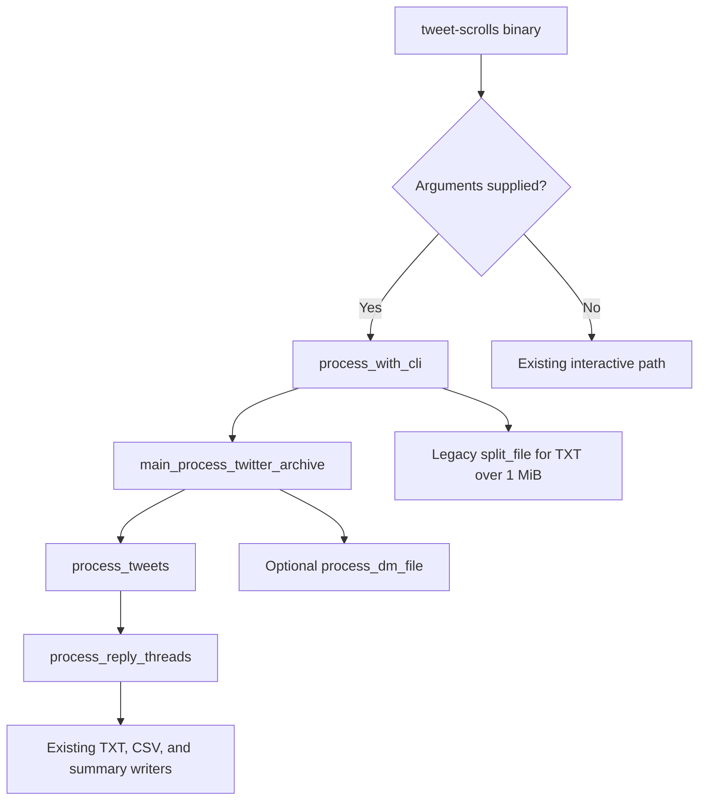
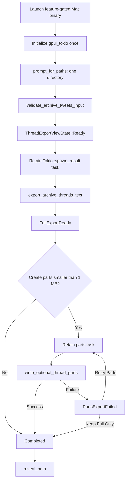

# LLM-ready Tweet Thread Exporter — Executable Specification

**Status:** Implementation-ready
**Date:** 2026-08-12
**Branch:** `Aug-12-01`
**Product milestone:** v0.0.2
**Architecture:** [LLM-ready Tweet Thread Exporter — GPUI Architecture](./2026-08-12-llm-thread-export-gpui-architecture.md)

## Executable Requirements

### Feature packet

| Input | Decision |
|---|---|
| Feature outcome | A native GPUI Mac app converts one extracted Twitter archive into a complete LLM-ready tweet-thread TXT and, only when requested, additional semantic TXT parts smaller than 1 MB |
| Primary actor | A macOS user with an extracted Twitter archive |
| System boundaries | GPUI presentation adapter, shared tweet parsing/thread reconstruction, TXT-only app output adapter, unchanged CLI adapter |
| Failure boundaries | Invalid archive, unreadable or malformed `tweets.js`, invalid tweet timestamp, output collision, full-write failure, impossible part limit, parts-write failure, dropped background task, Finder reveal failure |
| Reliability limits | Completed names appear only after successful flush and rename; full output survives optional-parts failure; at most one active job per window |
| Capacity limit | Each optional part is valid UTF-8 and strictly less than 1,000,000 bytes |
| Language/runtime | Rust 2021, Tokio, Zed GPUI on macOS; GPUI dependencies feature-gated away from the CLI |
| Explicit non-goals | DMs, CSV, JSON, analytics, cloud upload, ZIP extraction, tweet browsing/editing, a new thread classifier, signing/notarization |

### Evidence ledger

The current repository and the local Zed reference repository were queried with `codebase-memory-mcp 0.8.1`; each material graph claim was then checked against source.

| Evidence | Graph finding | Verified source consequence |
|---|---|---|
| `process_tweets` | Three direct callers and direct calls to reply grouping, TXT writing, and CSV writing | [`src/processing/tweets.rs:18`](../../src/processing/tweets.rs) is a mixed orchestration function, not the GPUI service boundary |
| `process_reply_threads` | Directly called by `process_tweets`; existing unit-test callers | [`src/processing/reply_threads.rs:17`](../../src/processing/reply_threads.rs) is the reusable thread-semantic seam |
| `write_threads_to_file` | Directly called by `process_tweets` and its test | [`src/processing/file_io.rs:58`](../../src/processing/file_io.rs) defines the established TXT block structure |
| `process_with_cli` | Calls archive orchestration and the legacy splitter | [`src/cli.rs:116`](../../src/cli.rs) owns current CLI paths, optional DM discovery, and post-processing |
| `create_chunks` | Called by `split_file`, CLI, splitter binary, and splitter tests | [`src/utils/file_splitter.rs:185`](../../src/utils/file_splitter.rs) copies fixed byte ranges and is not valid for semantic UTF-8 parts |
| GPUI `prompt_for_paths` | Platform method exists for macOS and other targets | Zed `crates/agent_ui/src/threads_archive_view.rs:1257` demonstrates a single-directory prompt |
| GPUI `Window::prompt` | Window/platform methods exist | Zed `crates/gpui/examples/window.rs:270` demonstrates asynchronously awaiting a button choice |
| GPUI Tokio `spawn_result` | One method in `gpui_tokio` | Zed `crates/gpui_tokio/src/gpui_tokio.rs:77` documents that dropping the returned task cancels its Tokio task |
| GPUI `reveal_path` | App/platform methods exist, including macOS | Zed `crates/gpui/src/app.rs:1544` documents Finder reveal behavior |
| GPUI tests | Test and visual-test contexts exist | Zed `crates/gpui/examples/testing.rs:215` demonstrates state, action, window, and async testing |

### Current control flow to preserve



The extraction may replace logic inside `process_tweets`, but the observable CLI edges and artifacts remain.

### Target GPUI control flow



The parts prompt is a control boundary: it cannot be displayed until `tweet-scrolls-full.txt` has its completed name.

### Target data flow

| Stage | Input | Transformation | Output owner |
|---|---|---|---|
| Archive selection | `PathBuf` | Validate directory and readable `tweets.js` | `ValidatedTweetArchive` |
| Run identity | Valid archive + injected Unix milliseconds | Derive `<archive>/tweet-scrolls-<timestamp>` | `CompleteThreadExportRequest` |
| Archive decoding | JavaScript-wrapped UTF-8 text | Select first `[` through last `]`; deserialize `Vec<TweetWrapper>` | `load_archive_tweet_threads` |
| Tweet filtering | `Vec<TweetWrapper>` | Unwrap tweets and exclude `retweeted == true` | Shared thread core |
| Thread reconstruction | `Vec<Tweet>` | Apply current reply-parent/child grouping and aggregate `Thread` values | `Arc<[Thread]>` in `PreparedThreadExportData` |
| Thread rendering | One non-empty `Thread` | Render established start/end markers, metadata, tweet ordinals, and text | `render_single_thread_block` |
| Full publication | Streamed rendered blocks | Write sibling `.partial`, flush, rename | `CompleteThreadExportResult` |
| Parts planning | Prepared threads + exclusive byte limit | Prefer whole threads, then tweet units, then UTF-8 text fragments | `SemanticThreadPartPlan` |
| Parts publication | Ordered part plan | Write numbered `.partial` files, flush, commit, cleanup on failure | `SemanticPartExportResult` |
| UI projection | Domain result or typed failure | Transition the single view-state enum | GPUI root entity |

`PreparedThreadExportData` retains the reconstructed threads only until the user declines parts or part generation finishes. Full and part writers stream blocks; they do not retain a second full rendered archive string.

### Required boundary shapes

The exact Rust syntax may follow compiler constraints, but the information ownership must remain equivalent to these shapes:

| Type | Required data | Ownership rule |
|---|---|---|
| `ValidatedTweetArchive` | `archive_folder`, `tweets_file` | Both are validated absolute or stable joined paths; no output exists yet |
| `CompleteThreadExportRequest` | validated archive, `timestamp_millis` | Timestamp is injected once by the adapter |
| `PreparedThreadExportData` | `Arc<[Thread]>` | Shared only across full-result handling and optional-parts generation |
| `CompleteThreadExportResult` | `output_folder`, `full_output_path`, `thread_count`, `byte_count` | Contains only durable completed paths |
| `CompleteThreadExportOutcome` | prepared data + complete result | Returned only after the full filename is committed |
| `SemanticPartExportRequest` | prepared data, output folder, `exclusive_byte_limit` | Production passes `1_000_000`; tests may pass smaller positive limits |
| `SemanticThreadPartPlan` | ordered descriptors plus exact final encoded byte lengths | Descriptors reference thread/tweet/UTF-8 ranges; they do not copy the entire rendered archive |
| `SemanticPartExportResult` | ordered completed part paths and byte counts | Returned only after the complete numbered set commits |
| `ThreadExportFailure` | `kind`, optional path, optional tweet ID, source message | Carries recovery-relevant context without archive content |

`ThreadExportFailureKind` must distinguish at least `InvalidArchive`, `ArchiveRead`, `ArchiveParse`, `InvalidTimestamp`, `InvalidThread`, `OutputCollision`, `FullOutputWrite`, `PartLimitTooSmall`, and `PartsOutputWrite`.

The view-state variants own the minimum data needed for their next legal action:

| State | Retained data |
|---|---|
| `NeedsArchive` | None |
| `InvalidArchive` | Validation failure |
| `Ready` | Validated archive |
| `ExportingFull` | Validated archive |
| `FullExportReady` | Complete outcome, including prepared threads |
| `FullExportFailed` | Selected archive and typed failure |
| `ExportingParts` | Complete outcome |
| `PartsExportFailed` | Complete outcome and typed parts failure |
| `Completed` | Complete result and optional parts result; prepared threads dropped |

The GPUI root entity additionally owns `Option<Task<()>>` solely to retain active background work. It is not a second status flag: the state enum remains authoritative for legal actions and rendering.

### REQ-ARCH-001.0: Validate selected archive

**WHEN** the user selects a filesystem path
**THEN** `validate_archive_tweets_input` SHALL accept it only when it is a directory containing a readable regular file named `tweets.js`
**AND** SHALL return a typed `InvalidArchive` failure containing the rejected path when validation fails
**SHALL** create no output folder during validation.

### REQ-ARCH-002.0: Parse wrapped tweet data

**WHEN** `tweets.js` is readable
**THEN** `load_archive_tweet_threads` SHALL deserialize the inclusive byte range from the first `[` through the last `]` as `Vec<TweetWrapper>`
**AND** SHALL accept an empty JSON array
**AND** SHALL return a typed `ArchiveParse` failure for missing brackets or invalid JSON
**SHALL NOT** panic for malformed archive content.

### REQ-CORE-001.0: Preserve current thread semantics

**WHEN** the shared core receives parsed tweets
**THEN** it SHALL exclude records only when their current `retweeted` field is true
**AND** SHALL preserve standalone non-retweets as one-tweet groups
**AND** SHALL reconstruct reply-connected groups through the current parent/child ID relationships
**AND** SHALL keep tweets inside each group in chronological order
**SHALL** calculate thread ID, tweet count, favorite total, and retweet total using the current conversion rules.

### REQ-CORE-002.0: Preserve semantic extraction parity

**WHEN** the same fixed archive fixture is processed before and after core extraction
**THEN** the canonical set of thread IDs and ordered tweet IDs within every group SHALL match
**AND** aggregate counts SHALL match
**SHALL NOT** require a stable relative order between distinct threads whose parsed root timestamps are equal.

### REQ-CORE-003.0: Reject invalid tweet timestamps safely

**WHEN** thread ordering encounters a `created_at` value that does not match `%a %b %d %H:%M:%S %z %Y`
**THEN** the shared loader SHALL return a typed `InvalidTimestamp` failure identifying the tweet ID
**SHALL NOT** panic or publish a completed output file.

### REQ-CORE-004.0: Handle empty tweet archives

**WHEN** `tweets.js` contains a valid empty array or all parsed tweets have `retweeted == true`
**THEN** the shared core SHALL return an empty prepared thread collection
**AND** the full export SHALL report a thread count of zero
**SHALL NOT** invent placeholder tweet content.

### REQ-TEXT-001.0: Render established thread blocks

**WHEN** `render_single_thread_block` receives a non-empty `Thread`
**THEN** it SHALL render the existing `--- Start of Thread ---` and `--- End of Thread ---` boundaries
**AND** SHALL render thread ID, first-tweet timestamp, first-tweet support counts, ordered tweet ordinals, and tweet text using the structure currently produced by `write_threads_to_file`
**SHALL** preserve every tweet text byte after Rust UTF-8 string decoding.

### REQ-TEXT-002.0: Reject empty thread models

**WHEN** the renderer receives a `Thread` whose tweet collection is empty
**THEN** it SHALL return a typed `InvalidThread` failure containing the thread ID
**SHALL NOT** index the missing first tweet or panic.

### REQ-PATH-001.0: Derive one app output folder

**WHEN** full export starts with archive path `A` and injected Unix-millisecond timestamp `T`
**THEN** `derive_timestamp_output_folder` SHALL return the immediate child `A/tweet-scrolls-T`
**AND** every app artifact for that run SHALL remain beneath that folder
**SHALL NOT** ask the GPUI user to select a destination.

### REQ-PATH-002.0: Reject output collisions

**WHEN** the derived `tweet-scrolls-T` path already exists
**THEN** full export SHALL return a typed `OutputCollision` failure
**AND** SHALL leave all existing contents unchanged
**SHALL NOT** merge, delete, or overwrite a previous run.

### REQ-FULL-001.0: Publish the complete TXT atomically

**WHEN** a non-colliding full export runs
**THEN** `write_complete_thread_output` SHALL stream all rendered thread blocks to `tweet-scrolls-full.txt.partial`
**AND** SHALL flush the writer before renaming it to `tweet-scrolls-full.txt`
**AND** SHALL return the completed path, byte count, and thread count only after the rename succeeds
**SHALL NOT** leave a completed filename after a pre-rename failure.

### REQ-FULL-002.0: Enforce the app artifact allowlist

**WHEN** the GPUI full export succeeds before optional parts are requested
**THEN** the output folder SHALL contain exactly `tweet-scrolls-full.txt`
**AND** SHALL contain no DM, CSV, JSON, analytics, relationship, result-summary, or legacy byte-split artifact
**SHALL NOT** invoke `process_with_cli`, `main_process_twitter_archive`, `process_dm_file`, `EnhancedCsvWriter`, or `split_file` from the GPUI export path.

### REQ-FULL-003.0: Complete a zero-thread export

**WHEN** the prepared collection contains zero threads
**THEN** full export SHALL atomically publish a zero-byte `tweet-scrolls-full.txt`
**AND** the view SHALL report completion with zero threads
**SHALL NOT** offer optional parts because no semantic part can contain tweet content.

### REQ-PART-001.0: Ask only after full publication

**WHEN** a non-empty full export succeeds
**THEN** the view SHALL enter `FullExportReady` only after `tweet-scrolls-full.txt` exists with its completed name
**AND** SHALL then prompt once with actions equivalent to `Create Parts` and `Keep Full Only`
**SHALL NOT** prompt after full-export failure.

### REQ-PART-002.0: Preserve full output when declined

**WHEN** the user chooses `Keep Full Only` or dismisses the optional-parts prompt
**THEN** the view SHALL enter `Completed`
**AND** the output folder SHALL retain `tweet-scrolls-full.txt`
**SHALL NOT** create a numbered part or reprocess the archive.

### REQ-PART-003.0: Produce bounded semantic parts

**WHEN** the user chooses `Create Parts`
**THEN** `plan_semantic_thread_parts` SHALL prefer complete rendered thread blocks as packing units
**AND** `write_optional_thread_parts` SHALL publish consecutive names beginning with `tweet-scrolls-part-001.txt`
**AND** every published part SHALL be non-empty, valid UTF-8, and at most 999,999 bytes
**AND** the ordered part payloads SHALL preserve full-export tweet order and text
**SHALL** produce one part when the non-empty full payload already fits the limit.

### REQ-PART-004.0: Split oversized semantic units safely

**WHEN** one rendered thread cannot fit below the exclusive 1,000,000-byte limit
**THEN** the planner SHALL split that thread first at rendered tweet boundaries
**AND** SHALL include thread ID and deterministic continuation ordinal metadata in every continuation segment
**AND** when one rendered tweet still cannot fit, SHALL split only its text at valid UTF-8 boundaries while retaining its tweet ordinal and continuation metadata
**SHALL** return typed `PartLimitTooSmall` rather than loop or emit an oversized file when required metadata alone cannot fit.

### REQ-PART-005.0: Isolate and recover part failures

**WHEN** planning, writing, flushing, or committing any optional part fails
**THEN** the view SHALL enter `PartsExportFailed` rather than full-export failure
**AND** `tweet-scrolls-full.txt` SHALL remain unchanged
**AND** no `SemanticPartExportResult` SHALL be returned
**AND** the writer SHALL best-effort remove part `.partial` files and final part names created by that attempt
**SHALL** clear stale part-attempt files before a `Retry Parts` operation.

### REQ-APP-001.0: Select one archive directory

**WHEN** the user requests archive selection
**THEN** `request_archive_folder_selection` SHALL call `prompt_for_paths` with `files: false`, `directories: true`, and `multiple: false`
**AND** a valid returned path SHALL be validated and projected into `Ready`
**SHALL** leave the existing view state unchanged when the prompt is cancelled or returns no path.

### REQ-APP-002.0: Enforce typed view transitions

**WHEN** a view action or asynchronous result arrives
**THEN** `transition_thread_export_state` SHALL permit only transitions defined in the architecture state diagram
**AND** SHALL derive enabled actions from the current enum variant
**SHALL** ignore an export action received outside `Ready` and a parts action received outside `FullExportReady` or `PartsExportFailed`.

### REQ-APP-003.0: Keep background work responsive

**WHEN** full or parts export begins
**THEN** `start_background_export_task` SHALL run the fallible operation through `Tokio::spawn_result`
**AND** the root entity SHALL retain the returned GPUI task until it resolves
**AND** the view SHALL process an independent state/action update while a controlled export future remains pending
**SHALL** allow at most one retained export task per window.

### REQ-APP-004.0: Present recoverable failures

**WHEN** archive validation or full export fails
**THEN** the view SHALL retain the selected archive when one exists and offer full-export retry
**AND** when optional parts fail, SHALL offer `Retry Parts` and `Keep Full Only`
**SHALL NOT** require application restart for either retry path.

### REQ-APP-005.0: Keep Finder reveal non-fatal

**WHEN** the user requests output reveal after `Completed`
**THEN** `reveal_completed_output_folder` SHALL pass the completed output folder to GPUI `reveal_path`
**AND** a reveal failure SHALL leave the export in `Completed`
**SHALL NOT** alter or delete exported files.

### REQ-CLI-001.0: Preserve CLI invocation and paths

**WHEN** the default-feature CLI is built and invoked
**THEN** it SHALL continue accepting `tweet-scrolls <archive-folder> [output-folder]`
**AND** SHALL preserve an explicit output-folder argument
**AND** without that argument SHALL retain the current `output_user_<unix-seconds>` folder pattern
**SHALL** preserve the existing no-argument interactive path.

### REQ-CLI-002.0: Preserve CLI artifacts and optional DMs

**WHEN** the CLI processes the fixed tweet-only and tweet-plus-DM fixtures
**THEN** it SHALL retain its existing TXT, CSV, results-summary, optional-DM, and greater-than-1-MiB legacy splitting behavior
**AND** its thread groups SHALL satisfy `REQ-CORE-002.0`
**SHALL NOT** require the `gpui-app` Cargo feature.

### REQ-BUILD-001.0: Isolate and pin GPUI dependencies

**WHEN** Cargo metadata is evaluated
**THEN** the Mac binary SHALL require an optional `gpui-app` feature
**AND** the CLI and library SHALL build without that feature
**AND** `gpui`, `gpui_platform`, and `gpui_tokio` SHALL resolve from one compatible source baseline, initially Zed revision `6bd93fc3195242834f4999f3b3daab294df6b253`
**SHALL NOT** commit an absolute dependency path to `/Users/amuldotexe/Desktop/oss-read-only/zed-gpui`.

### REQ-BUILD-002.0: Produce a launchable Mac application

**WHEN** the documented local packaging command succeeds on macOS
**THEN** it SHALL create a `.app` bundle containing the feature-gated GPUI binary
**AND** launching the bundle SHALL open one root window
**SHALL** defer signing, notarization, and Mac App Store distribution.

### REQ-PRIV-001.0: Keep archive processing local

**WHEN** archive validation, full export, or optional-part export executes
**THEN** the thread-export and Mac-adapter modules SHALL perform filesystem and in-process computation only
**AND** SHALL import no HTTP client or network transport API
**SHALL NOT** transmit archive content, output content, paths, telemetry, or analytics.

## Test Matrix

Test functions use four-word semantic names. Stable `TEST-*` IDs and `REQ-*` IDs live in comments or test metadata rather than lengthening function names.

| req_id | test_id | type | assertion | target |
|---|---|---|---|---|
| REQ-ARCH-001.0 | TEST-UNIT-ARCH-001 | unit | valid directory with readable `tweets.js` returns a validated archive | `archive_folder_validation_succeeds` |
| REQ-ARCH-001.0 | TEST-NEG-ARCH-002 | negative | file path, missing file, and unreadable file return `InvalidArchive` and create no output | `archive_folder_validation_fails` |
| REQ-ARCH-002.0 | TEST-UNIT-ARCH-003 | unit | JavaScript prefix/suffix around a valid array parses | `javascript_archive_parsing_succeeds` |
| REQ-ARCH-002.0 | TEST-NEG-ARCH-004 | negative | missing brackets and malformed JSON return `ArchiveParse` without panic | `javascript_archive_parsing_fails` |
| REQ-CORE-001.0 | TEST-UNIT-CORE-001 | unit | flagged retweets are excluded; standalone and connected replies use current grouping and aggregates | `current_thread_semantics_match` |
| REQ-CORE-002.0 | TEST-CHAR-CORE-002 | characterization | canonical thread/tweet ID groups and totals match the pre-extraction fixture oracle | `legacy_thread_groups_match` |
| REQ-CORE-003.0 | TEST-NEG-CORE-003 | negative | invalid `created_at` returns tweet-scoped `InvalidTimestamp` | `invalid_timestamp_returns_error` |
| REQ-CORE-004.0 | TEST-UNIT-CORE-004 | unit | empty/all-retweet input returns zero prepared threads | `empty_archive_exports_zero` |
| REQ-TEXT-001.0 | TEST-GOLD-TEXT-001 | golden | one/multiple tweet blocks match the established exact TXT fixture | `thread_block_rendering_matches` |
| REQ-TEXT-002.0 | TEST-NEG-TEXT-002 | negative | empty thread returns `InvalidThread` without panic | `empty_thread_rendering_fails` |
| REQ-PATH-001.0 | TEST-UNIT-PATH-001 | unit | fixed timestamp derives immediate `tweet-scrolls-T` child | `timestamp_output_folder_derives` |
| REQ-PATH-002.0 | TEST-INTEG-PATH-002 | integration | existing output folder returns collision and preserves sentinel bytes | `existing_output_folder_conflicts` |
| REQ-FULL-001.0 | TEST-INTEG-FULL-001 | integration | successful full write flushes, renames, reports byte count, and leaves no partial | `complete_output_commit_succeeds` |
| REQ-FULL-001.0 | TEST-NEG-FULL-002 | negative | forced commit failure exposes no completed full filename and cleans temporary file best-effort | `failed_output_commit_cleans` |
| REQ-FULL-002.0 | TEST-INTEG-FULL-003 | integration | GPUI service output has exactly one full TXT before parts and no forbidden artifacts | `app_artifact_allowlist_matches` |
| REQ-FULL-003.0 | TEST-INTEG-FULL-004 | integration | zero threads publishes zero-byte full file and completes without parts offer | `empty_export_completion_succeeds` |
| REQ-PART-001.0 | TEST-STATE-PART-001 | state | prompt event is impossible before committed full result and occurs once afterward | `parts_prompt_follows_commit` |
| REQ-PART-002.0 | TEST-INTEG-PART-002 | integration | decline/dismiss preserves full only and does not reload archive | `parts_decline_preserves_full` |
| REQ-PART-003.0 | TEST-PROP-PART-003 | property | every planned/written part is UTF-8, non-empty, below limit, consecutive, and order-preserving | `semantic_parts_respect_limit` |
| REQ-PART-003.0 | TEST-UNIT-PART-004 | unit | a non-empty payload below the limit produces exactly part 001 | `small_export_creates_one` |
| REQ-PART-004.0 | TEST-UNIT-PART-005 | unit | oversized thread splits at tweet boundaries with deterministic continuation metadata | `oversized_thread_splits_tweets` |
| REQ-PART-004.0 | TEST-PROP-PART-006 | property | oversized Unicode tweet splits only at valid UTF-8 boundaries and reconstructs its text | `oversized_tweet_splits_utf8` |
| REQ-PART-004.0 | TEST-NEG-PART-007 | negative | limit smaller than required metadata returns `PartLimitTooSmall` | `impossible_part_limit_fails` |
| REQ-PART-005.0 | TEST-INTEG-PART-008 | integration | injected filesystem conflict during commit reports parts failure and preserves full bytes | `failed_parts_preserve_full` |
| REQ-PART-005.0 | TEST-INTEG-PART-009 | integration | retry removes stale attempt files then publishes one complete numbered set | `retried_parts_cleanup_stale` |
| REQ-APP-001.0 | TEST-GPUI-APP-001 | GPUI | picker request config permits one directory and no files | `folder_picker_config_matches` |
| REQ-APP-001.0 | TEST-GPUI-APP-002 | GPUI | picker cancellation leaves state unchanged | `folder_picker_cancel_stays` |
| REQ-APP-002.0 | TEST-UNIT-APP-003 | unit | allowed state edges match the architecture and invalid action edges are ignored | `view_state_transitions_match` |
| REQ-APP-002.0 | TEST-GPUI-APP-004 | GPUI | repeated export dispatch while exporting starts no second task | `duplicate_export_action_ignored` |
| REQ-APP-003.0 | TEST-GPUI-APP-005 | async GPUI | pending controlled export remains retained while an independent update is processed | `inflight_export_task_retained` |
| REQ-APP-004.0 | TEST-GPUI-APP-006 | GPUI | full failure retains selection and retry reaches full-ready | `export_failure_retry_succeeds` |
| REQ-APP-004.0 | TEST-GPUI-APP-007 | GPUI | parts failure offers both recovery actions and retry reaches completed | `parts_failure_retry_succeeds` |
| REQ-APP-005.0 | TEST-GPUI-APP-008 | GPUI | reveal error leaves state completed and files unchanged | `finder_reveal_failure_nonfatal` |
| REQ-CLI-001.0 | TEST-CHAR-CLI-001 | characterization | argument forms, explicit output, default path pattern, and interactive branch remain | `cli_invocation_contract_remains` |
| REQ-CLI-002.0 | TEST-CHAR-CLI-002 | characterization | fixed fixtures preserve artifact categories, DM conditional, and split threshold | `cli_artifact_contract_remains` |
| REQ-CLI-002.0 | TEST-INTEG-CLI-003 | integration | CLI and app core produce identical canonical thread groups | `cli_thread_semantics_match` |
| REQ-BUILD-001.0 | TEST-BUILD-001 | build | library and CLI build without `gpui-app`; Mac binary builds with it | `gpui_feature_boundary_builds` |
| REQ-BUILD-001.0 | TEST-META-002 | metadata | three GPUI crates resolve to one baseline and no absolute local path exists | `gpui_dependencies_revision_match` |
| REQ-BUILD-002.0 | TEST-SMOKE-003 | smoke | packaged `.app` launches one window on macOS | `mac_app_bundle_launches` |
| REQ-PRIV-001.0 | TEST-STATIC-PRIV-001 | static | new export/Mac modules contain no HTTP or transport imports/calls | `export_modules_network_free` |

### Fixture packet

The test suite needs these checked-in synthetic fixtures; it must not contain a real user archive:

| Fixture | Purpose |
|---|---|
| `tweets_empty.js` | Valid empty array |
| `tweets_all_retweets.js` | Zero retained groups |
| `tweets_standalone_reply.js` | Standalone plus connected reply semantics |
| `tweets_same_timestamp.js` | Canonical parity without assuming tie order |
| `tweets_unicode.js` | Multi-byte tweet text and exact preservation |
| `tweets_invalid_json.js` | Typed parse failure |
| `tweets_invalid_timestamp.js` | Typed timestamp failure |
| `direct_messages_minimal.js` | CLI-only optional-DM characterization |

Large part-planning inputs should be generated synthetically in tests so megabyte fixtures are not committed.

## TDD Plan

### Slice 0: Characterize the baseline

**STUB**

- Add `legacy_thread_groups_match`, `cli_invocation_contract_remains`, and `cli_artifact_contract_remains` around fixed synthetic fixtures.
- Record the canonical semantic oracle as thread ID plus ordered tweet IDs, not raw hash-map iteration order.

**RED**

- Confirm tests fail only because the fixture harness/oracle is incomplete.
- Re-run `cargo test --all-targets` and record the current baseline: 81 passed, one failed at `src/utils/file_splitter.rs:394`, plus existing warnings.

**GREEN**

- Complete the fixture harness without changing production behavior.
- Correct or explicitly normalize the canonical-versus-noncanonical expectation in the existing custom-output-directory splitter test.

**REFACTOR**

- Centralize synthetic tweet builders and canonical group comparison.

**VERIFY**

- Require the characterized pre-feature suite to be green before extracting production logic.

### Slice 1: Prove the dependency boundary

**STUB**

- Declare an optional `gpui-app` feature and a Mac binary with `required-features = ["gpui-app"]`.
- Add `gpui_feature_boundary_builds` and `gpui_dependencies_revision_match` checks.

**RED**

- Confirm the Mac target is unavailable before dependencies and the default CLI remains buildable.

**GREEN**

- Pin `gpui`, `gpui_platform`, and `gpui_tokio` to the same verified source baseline.
- Open a minimal GPUI window; do not build product UI yet.

**REFACTOR**

- Keep every GPUI import under the feature-gated adapter/binary boundary.

**VERIFY**

- Run both the default CLI build and feature-enabled Mac build.

### Slice 2: Extract shared archive semantics

**STUB**

- Write failing tests for `validate_archive_tweets_input`, `load_archive_tweet_threads`, invalid timestamps, empty arrays, and parity.
- Introduce typed request, prepared-data, result, and failure contracts.

**RED**

- Confirm failures identify missing new interfaces, while the characterization oracle stays green.

**GREEN**

- Implement `validate_archive_tweets_input`.
- Implement `load_archive_tweet_threads` by extracting parsing, filtering, grouping, timestamp validation, and `Thread` conversion from `process_tweets`.
- Route `process_tweets` through the extracted core while retaining existing CLI writers and orchestration.

**REFACTOR**

- Use `convert_grouped_thread_models` and `calculate_thread_metric_totals` only if they reduce duplication.
- Replace new production `unwrap`/`expect` calls with typed failures.

**VERIFY**

- Run core unit tests, semantic parity tests, and all CLI characterization tests.

### Slice 3: Extract rendering and publish the full TXT

**STUB**

- Add golden renderer tests, empty-thread failure, fixed timestamp path, collision, atomic success/failure, allowlist, and zero-thread export tests.

**RED**

- Confirm failures correspond to absent renderer/path/service functions.

**GREEN**

- Implement `render_single_thread_block`, `derive_timestamp_output_folder`, `commit_atomic_output_file`, `write_complete_thread_output`, and `export_archive_threads_text`.
- Reuse the renderer from the CLI TXT writer without changing its filename or artifact behavior.

**REFACTOR**

- Stream thread blocks through `BufWriter`; do not create one archive-sized `String`.
- Keep validation before output-folder creation.

**VERIFY**

- Run golden, integration, allowlist, collision, and failure-cleanup tests.

### Slice 4: Plan and publish semantic parts

**STUB**

- Add bounded-size, order, single-part, oversized-thread, oversized-Unicode-tweet, impossible-limit, failed-attempt, and retry tests.

**RED**

- Confirm the legacy splitter cannot satisfy UTF-8/thread contracts and is never called by these tests.

**GREEN**

- Implement `plan_semantic_thread_parts`, `split_oversized_thread_units`, `split_oversized_tweet_units`, `cleanup_failed_part_attempt`, and `write_optional_thread_parts`.
- Count final encoded bytes including continuation metadata before accepting a plan.

**REFACTOR**

- Separate pure planning from filesystem publication.
- Keep production limit as an exclusive 1,000,000-byte constant while allowing smaller test limits.

**VERIFY**

- Run unit, property, and integration part tests; independently read every output with `read_to_string` and inspect metadata length.

### Slice 5: Implement the pure application state machine

**STUB**

- Add all allowed and rejected transitions, action derivation, duplicate dispatch, full failure retry, parts failure retry, and zero-thread completion tests.

**RED**

- Confirm invalid transitions are observable before state guards exist.

**GREEN**

- Implement `ThreadExportViewState` and `transition_thread_export_state`.
- Make the state enum the only authority for buttons, status text, selected archive, prepared data, results, and recovery actions.

**REFACTOR**

- Remove independent `is_loading`, `has_error`, and similarly overlapping booleans.

**VERIFY**

- Run the pure state suite without creating a GPUI window.

### Slice 6: Connect GPUI controls and Tokio

**STUB**

- Add GPUI tests for picker configuration/cancel, retained pending task, prompt timing, duplicate clicks, retries, and reveal failure.

**RED**

- Confirm the view cannot reach the required states before action handlers and task bridging exist.

**GREEN**

- Implement `request_archive_folder_selection`, `start_background_export_task`, `handle_full_export_result`, `request_optional_parts_choice`, `handle_parts_export_result`, and `reveal_completed_output_folder`.
- Store the in-flight GPUI task in the root entity until completion.

**REFACTOR**

- Keep domain results independent of GPUI and make render code a projection of state.

**VERIFY**

- Run `#[gpui::test]` state/action tests and a manual small-archive conversion while interacting with the window during processing.

### Slice 7: Package and verify end to end

**STUB**

- Add the app-bundle smoke check and static privacy/feature-boundary checks.

**RED**

- Confirm the smoke check fails before bundle metadata/build automation exists.

**GREEN**

- Produce the unsigned local `.app` and document one repeatable packaging command.

**REFACTOR**

- Keep packaging inputs minimal and outside runtime domain modules.

**VERIFY**

- Launch the bundle, select a synthetic archive, produce full TXT, exercise both parts choices, reveal the folder, and rerun CLI fixtures.

### Four-word implementation names

New production functions should use these names unless compilation or a verified GPUI trait signature requires an exception:

| Responsibility | Symbol |
|---|---|
| Validate archive | `validate_archive_tweets_input` |
| Load semantic groups | `load_archive_tweet_threads` |
| Convert group models | `convert_grouped_thread_models` |
| Calculate totals | `calculate_thread_metric_totals` |
| Render one thread | `render_single_thread_block` |
| Derive output path | `derive_timestamp_output_folder` |
| Commit one file | `commit_atomic_output_file` |
| Write full output | `write_complete_thread_output` |
| Orchestrate full export | `export_archive_threads_text` |
| Plan parts | `plan_semantic_thread_parts` |
| Split large thread | `split_oversized_thread_units` |
| Split large tweet | `split_oversized_tweet_units` |
| Cleanup failed parts | `cleanup_failed_part_attempt` |
| Write optional parts | `write_optional_thread_parts` |
| Transition app state | `transition_thread_export_state` |
| Request folder | `request_archive_folder_selection` |
| Start background work | `start_background_export_task` |
| Handle full result | `handle_full_export_result` |
| Request parts choice | `request_optional_parts_choice` |
| Handle parts result | `handle_parts_export_result` |
| Reveal output | `reveal_completed_output_folder` |

Existing public names such as `process_tweets`, `process_with_cli`, and GPUI-required trait methods remain unchanged for compatibility.

## Quality Gates

### Requirement traceability gate

- [ ] Every `REQ-*` heading appears in the test matrix.
- [ ] Every test matrix row names an executable test or build/smoke check.
- [ ] Every Rust test contains its `TEST-*` and `REQ-*` references in an adjacent comment or attribute.
- [ ] No requirement depends only on manual inspection except the final app interaction smoke pass, which supplements automated state tests.

### Rust quality gate

```bash
cargo fmt --check
cargo check --bin tweet-scrolls
cargo test --lib
cargo test --tests
cargo check --features gpui-app --bin tweet-scrolls-mac
cargo test --features gpui-app
cargo clippy --all-targets --all-features
```

- [ ] The pre-existing splitter-path failure is green before feature completion is claimed.
- [ ] No new compiler or Clippy warning originates in `src/thread_export/`, `src/mac_app/`, or `src/bin/tweet_scrolls_mac.rs`.
- [ ] No new `TODO`, `STUB`, or `FIXME` exists in feature code.
- [ ] No new production `unwrap()` or `expect()` exists in thread-export or Mac-adapter code; the application startup boundary may use one documented fatal initialization failure if GPUI requires it.
- [ ] New non-trait function names contain four semantic words; existing APIs and required trait signatures are exempt.

### Contract behavior gate

- [ ] Full TXT exists before the optional-parts prompt can be observed.
- [ ] Full TXT bytes remain identical after a declined, failed, or retried parts attempt.
- [ ] Every part is valid UTF-8, non-empty, and `metadata.len() < 1_000_000`.
- [ ] App output contains only the complete TXT and any explicitly requested numbered TXT parts.
- [ ] App fixtures never enter DM, CSV, result-summary, relationship, or legacy splitter paths.
- [ ] CLI characterization fixtures retain current command, path, artifact, optional-DM, and legacy-split behavior.
- [ ] Default CLI/library builds do not compile GPUI dependencies.
- [ ] Feature-enabled GPUI work is performed outside rendering and the root entity retains the task.

### Dependency and privacy gate

- [ ] `cargo metadata` shows `gpui`, `gpui_platform`, and `gpui_tokio` on one compatible source revision.
- [ ] No committed dependency contains the absolute local Zed checkout path.
- [ ] Static search of new modules finds no HTTP client, socket, telemetry, analytics, or upload API.
- [ ] Synthetic fixtures contain no real Twitter archive content, personal handle, DM, token, or credential.

### Release evidence packet

Before declaring v0.0.2 complete, record:

- Exact test commands and exit codes.
- The final requirement-to-test coverage report.
- One `cargo metadata` excerpt proving the feature/dependency boundary.
- The `.app` bundle path and launch smoke result.
- The fixed fixture's CLI artifact list and GPUI artifact list.
- Byte sizes and UTF-8-read results for a generated multi-part export.

## Open Questions

No open question blocks core implementation. Two release-level decisions remain:

1. **Version label:** `Cargo.toml` currently declares `0.1.0`, while this product milestone is called v0.0.2. Decide before tagging whether v0.0.2 is a product milestone only or whether the Cargo package version should also change.
2. **Bundle identity:** choose the final `.app` display name and reverse-DNS bundle identifier before the packaging slice. The executable name remains `tweet-scrolls-mac` unless packaging evidence requires otherwise.

The following are explicitly closed decisions, not open questions:

- Current reply-grouping semantics define “thread” for v0.0.2.
- The app exports no DMs.
- The app produces TXT only.
- The full TXT is always retained.
- Optional parts use a strict exclusive limit of 1,000,000 bytes.
- The existing raw-byte splitter remains CLI-only.
