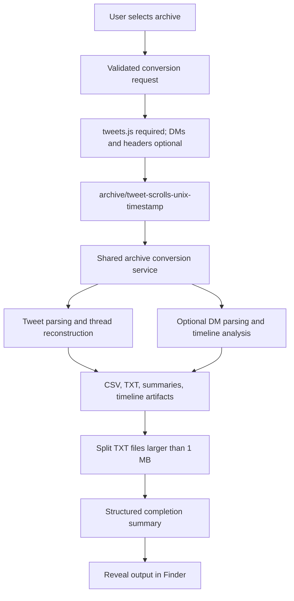
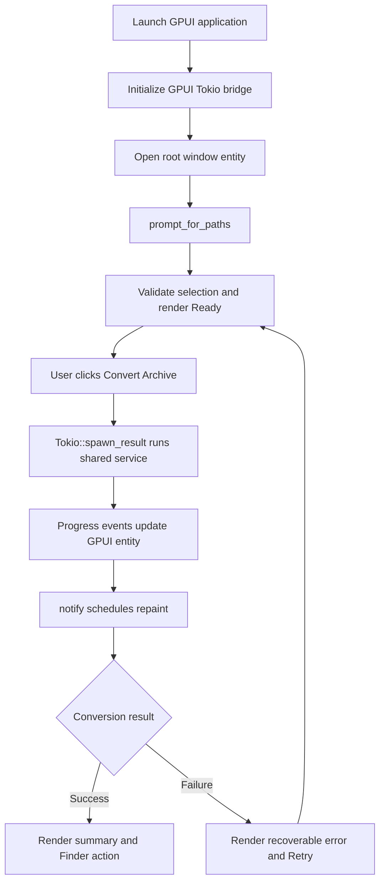
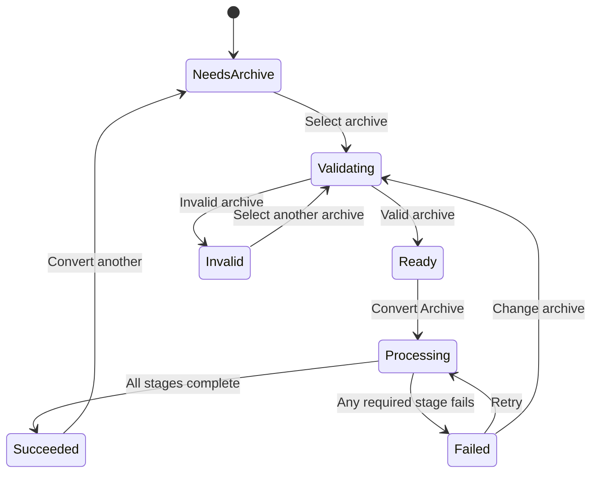

# Same CLI, but Zed GPUI UI

**Status:** Proposed for approval

**Date:** 2026-08-12

**Branch:** `Aug-12-01`
**Product posture:** Preserve the conversion engine; replace terminal friction with a focused native macOS workflow.

## Executive recommendation

Build a native macOS GPUI application around one shared archive-conversion service. The service becomes the only orchestration path for both the existing CLI and the new GUI. It validates the archive, processes tweets and optional direct messages, splits generated TXT files larger than 1 MB, and returns a structured completion summary.

This is the smallest approach that delivers GUI convenience without creating a second implementation of Tweet-Scrolls.

The first release is intentionally narrow:

- Choose an extracted Twitter archive folder.
- Automatically create `<archive>/tweet-scrolls-<unix-timestamp>/` for output.
- Convert tweets and optional direct messages using the existing processing code.
- Split output TXT files larger than 1 MB, exactly as the CLI does.
- Show stage-level progress and actionable errors.
- Reveal successful output in Finder.
- Produce a locally runnable macOS `.app` bundle.

Relationship-intelligence generation is not part of this release because it is not part of the current non-interactive CLI path.

## Product decision frame

This PRD follows [Shreyas Doshi's product-decision questions](https://x.com/shreyas/status/1290703709270228993): identify the user need, establish why it matters, compare expected and unexpected solutions, name trade-offs, expose unknowns, and say how those unknowns will become known.

### What is the user need?

A person with an exported Twitter archive wants the useful output of Tweet-Scrolls without remembering a command, navigating Terminal, interpreting console logs, or manually locating generated files.

### Why is it important?

The conversion engine already creates useful tweet threads, DM threads, summaries, and timeline analysis. The adoption bottleneck is the interaction model. A native app turns a specialist CLI into a repeatable personal workflow while keeping all private archive data on the Mac.

### What outcome matters?

The user should move from an extracted archive to visible output with confidence:

1. Select the archive.
2. Start conversion.
3. Understand what the app is doing.
4. Open the completed result in Finder.

The product is successful when the GUI produces the same artifacts as the CLI and makes failure states easier to understand.

## Problem statement

Tweet-Scrolls currently requires terminal familiarity. Its processing functions communicate through `println!`, its CLI performs orchestration and post-processing directly, and success is primarily conveyed as console text. This creates four user-facing problems:

- Archive paths are easy to mistype.
- Long-running work has no native visual state.
- Errors are mixed into terminal output instead of being presented next to the failed action.
- Finding the timestamped output directory requires returning to Finder manually.

The issue is not missing conversion capability. It is that the capability is packaged as an operator tool rather than a Mac product.

## Solution

Create a single-window macOS application using Zed's GPUI framework. The app presents archive selection, validation, conversion progress, completion details, and a Finder action. It creates a child output folder inside the selected archive named `tweet-scrolls-<unix-timestamp>`; there is no output picker.

Underneath the UI, extract a deep archive-conversion service from the current CLI orchestration. Both the CLI and GPUI adapters submit the same typed request and receive the same typed result. UI-specific state and GPUI dependencies remain outside the processing library.

## Product principles

1. **Same engine, new surface.** GUI parity comes from sharing the orchestration path, not reimplementing it.
2. **Local by default.** The app does not upload, transmit, or remotely analyze archive content.
3. **Stage truth over fake precision.** Show real processing stages rather than an invented percentage.
4. **One primary action.** Once the archive is valid, the interface should make “Convert Archive” unmistakable.
5. **Errors must suggest recovery.** State what failed, preserve the selected archive, and let the user retry.
6. **Completion includes post-processing.** The app reports success only after large TXT splitting has completed.

## Target user

The primary user has downloaded and extracted a Twitter/X archive on macOS and wants human-readable or LLM-friendly text and CSV artifacts. They understand folders, but should not need Rust, Cargo, shell commands, or the internal Twitter archive schema.

## Success criteria

### Product success

- A valid archive can be converted without opening Terminal.
- The happy path requires no manually typed filesystem path.
- A user can reach the generated output from the completion screen with one click.
- The UI remains responsive during conversion.
- A failed conversion leaves the app usable and ready to retry.

### Functional parity

- Given the same archive and timestamp, the default CLI path and GUI path resolve the same `tweet-scrolls-<unix-timestamp>` output folder and use the same processing service.
- Tweets remain required.
- Direct messages and direct-message headers remain optional.
- Generated TXT files larger than 1 MB are split into 1 MB chunks.
- Success is returned only after output generation and splitting are complete.

### Quality measures

- All new domain and orchestration tests pass.
- GPUI state-transition tests cover ready, processing, success, failure, and retry behavior.
- A fixture-based parity test verifies that CLI and GUI adapters request the same conversion behavior.
- No archive content crosses a network boundary.
- On a fixed representative fixture, the shared service introduces no more than 10% orchestration overhead compared with the current CLI path. This excludes app launch and user interaction time.

## User stories

1. As a Twitter archive owner, I want to select my archive in Finder, so that I do not have to type a path.
2. As a Twitter archive owner, I want the app to identify whether `tweets.js` exists, so that I know I selected the correct folder.
3. As a Twitter archive owner, I want direct messages to be detected automatically, so that I do not have to configure optional inputs.
4. As a Twitter archive owner, I want direct-message headers to be detected automatically, so that supported metadata can flow through without another picker.
5. As a Twitter archive owner, I want output created automatically in `tweet-scrolls-<unix-timestamp>` inside my archive, so that I do not need another folder decision.
6. As a Twitter archive owner, I want the app to summarize detected inputs before conversion, so that I can catch a wrong selection.
7. As a Twitter archive owner, I want the Convert button disabled until the request is valid, so that I cannot start a predictably invalid job.
8. As a Twitter archive owner, I want stage-level progress, so that I know the app has not frozen.
9. As a Twitter archive owner, I want the selected archive to remain visible during processing, so that I know which archive is active.
10. As a Twitter archive owner, I want duplicate conversion clicks prevented, so that one archive is not processed twice concurrently.
11. As a Twitter archive owner, I want tweet threads generated exactly as the CLI generates them, so that moving to the GUI does not alter my data.
12. As a Twitter archive owner, I want optional DM artifacts generated when DM data exists, so that the GUI preserves CLI behavior.
13. As a Twitter archive owner, I want DM absence treated as valid, so that tweet-only archives still work.
14. As a Twitter archive owner, I want large TXT artifacts split automatically, so that they remain easy to review and upload to LLM tools.
15. As a Twitter archive owner, I want splitting failures reported as conversion failures, so that I do not mistake partial output for complete output.
16. As a Twitter archive owner, I want a concise completion summary, so that I understand what was generated.
17. As a Twitter archive owner, I want to reveal the output folder in Finder, so that I can use the files immediately.
18. As a Twitter archive owner, I want actionable validation errors, so that I know how to correct the selected folder.
19. As a Twitter archive owner, I want parsing errors to identify the failing input category, so that I know whether tweets or DMs caused the failure.
20. As a Twitter archive owner, I want my selected archive preserved after failure, so that retrying does not restart setup.
21. As a privacy-conscious user, I want conversion to remain local, so that my archive is not exposed to a remote service.
22. As a repeat user, I want the app to remain open after completion, so that I can convert another archive.
23. As a CLI user, I want current command behavior preserved, so that the GUI does not break scripts.
24. As a maintainer, I want CLI and GUI to call one orchestration service, so that fixes apply to both surfaces.
25. As a maintainer, I want progress represented as typed events, so that user feedback is not coupled to console strings.
26. As a maintainer, I want conversion results represented as structured data, so that UI success does not depend on scraping logs.
27. As a maintainer, I want GPUI and Tokio boundaries isolated, so that UI framework changes do not spread into archive parsing.
28. As a maintainer, I want a pinned GPUI baseline, so that upstream API churn cannot silently break builds.
29. As a maintainer, I want the app bundle produced by a documented build command, so that a runnable `.app` is reproducible.

## Scope

### In scope

- Native macOS GPUI window.
- Archive-folder picker.
- Automatic `<archive>/tweet-scrolls-<unix-timestamp>/` output folder.
- Input detection and validation.
- Tweet processing.
- Optional DM processing.
- Existing CSV and TXT output behavior.
- Existing 1 MB TXT splitting behavior.
- Stage-level progress.
- Structured success and error states.
- Reveal output in Finder.
- Local `.app` bundle generation.
- Existing CLI compatibility.

### Out of scope

- Relationship-intelligence generation from the interactive CLI path.
- Editing or browsing tweet content inside the app.
- Charting, dashboards, or data visualization.
- Drag-and-drop archive ZIP support.
- Automatic ZIP extraction.
- Fine-grained percentage progress.
- Conversion cancellation in the first release.
- Concurrent conversion jobs.
- Windows or Linux packaging.
- Mac App Store distribution, signing, or notarization.
- Network sync, cloud storage, telemetry, or analytics.
- Changes to output schemas or thread-building algorithms.
- Custom output selection in the GPUI app.

## Approaches considered

### Approach A: Call the current CLI function directly

The GPUI view would construct the existing CLI configuration and invoke the CLI entry path.

**Advantages**

- Smallest initial patch.
- Maximum reuse of current orchestration.

**Disadvantages**

- Progress and results remain console strings.
- CLI validation and UI validation become entangled.
- The function does not return an artifact summary.
- UI testing becomes dependent on filesystem side effects and printed output.

**Decision:** Reject. It is fast to demo but creates a shallow UI wrapper with poor product-state semantics.

### Approach B: Extract one shared archive-conversion service

Both CLI and GPUI adapters build a typed request and call the same service. The service owns validation, tweet and optional DM orchestration, output splitting, typed progress events, and the completion summary.

**Advantages**

- One source of truth for parity.
- Clean progress and error contracts.
- Testable without GPUI.
- CLI behavior remains available.
- GPUI stays a presentation adapter.

**Disadvantages**

- Requires a deliberate orchestration refactor before the UI can be completed.
- Existing print-based status messages must be separated from product events.

**Decision:** Recommended. This is the best balance of product quality, implementation effort, and long-term maintainability.

### Approach C: Run the CLI as a subprocess

The app would spawn the current binary and translate stdout, stderr, and exit status into UI state.

**Advantages**

- Strong runtime isolation.
- Minimal change to the processing library.

**Disadvantages**

- Requires bundling and locating a second executable.
- Progress relies on parsing unstable human-readable logs.
- Cancellation and error classification become process-management problems.
- CLI and app releases can become mismatched.

**Decision:** Reject for the first release. It adds packaging and observability complexity without product benefit.

## Evidence from the existing codebase

The code graph and source verification show the current control path:

1. The main binary parses a `CliConfig` and calls `process_with_cli` when a folder argument is present.
2. `process_with_cli` resolves `tweets.js`, optional `direct-messages.js`, optional headers, timestamp, and output directory.
3. It calls `main_process_twitter_archive`.
4. `main_process_twitter_archive` creates the output directory, calls `process_tweets`, and conditionally calls `process_dm_file`.
5. `process_tweets` reads JavaScript-wrapped JSON, deserializes `TweetWrapper` values, filters retweets, reconstructs reply threads, and writes TXT, CSV, and summary files.
6. `process_dm_file` reads and parses `DmWrapper` values, calculates timeline data, and writes DM CSV, thread, timeline, and summary artifacts.
7. Control returns to `process_with_cli`, which scans generated TXT files and calls `split_file` for files larger than 1 MB.

The extraction boundary is therefore between the input adapter and this seven-step orchestration. The processing algorithms and data models do not need a GPUI dependency.

## Evidence from Zed GPUI

The local Zed source at revision `6bd93fc31952` demonstrates each required control primitive:

- `application().run` owns the native application lifecycle.
- `open_window` creates a window whose root is a GPUI entity implementing `Render`.
- `prompt_for_paths` returns an asynchronous receiver for native file or directory selection.
- `spawn_in` and `window.spawn` await asynchronous work without blocking rendering.
- `gpui_tokio::init` installs a Tokio runtime inside the GPUI app.
- `Tokio::spawn_result` runs Tokio-dependent work and exposes its result as a GPUI task.
- Entity updates followed by `notify` schedule a repaint.
- `reveal_path` reveals a generated path in Finder on macOS.
- GPUI's test context can exercise entity state and rendered action dispatch.

GPUI is Apache-2.0 licensed. The studied GPUI crate reports version `0.2.2`; the implementation should pin the dependency baseline rather than follow a moving branch.

## Proposed architecture

### L1: Domain contracts

Framework-independent types define:

- Archive path.
- Derived output path.
- Detected optional inputs.
- Validated conversion request.
- Processing stage event.
- Artifact summary.
- Typed conversion error.

Invalid requests should not reach the processing service.

### L2: Archive conversion service

A deep service owns the complete operation behind a small interface:

- Validate and resolve inputs.
- Create `<archive>/tweet-scrolls-<unix-timestamp>/`.
- Process tweets.
- Process optional DMs.
- Scan and split large TXT outputs.
- Emit stage events.
- Return a structured summary only when every required stage succeeds.

The existing CLI becomes an adapter to this service rather than an orchestration owner.

### L3: Application adapters

**CLI adapter**

- Converts command arguments into the shared request.
- Renders typed stages and errors as terminal messages.
- Preserves existing command syntax, including the optional CLI output override, while aligning the default output name with the GPUI app.

**GPUI adapter**

- Owns view state, button actions, native path prompts, and rendering.
- Initializes the Tokio bridge at app startup.
- Runs the shared service off the UI thread.
- Translates progress events and the final result into visible state.
- Reveals the output path in Finder on request.

**macOS bundle adapter**

- Packages the release binary and minimum bundle metadata into a reproducible `.app`.

## Data flow

## GPUI control flow

## UI model

### Primary screen

- Product name and one-sentence privacy promise.
- Archive folder row with selection button and detected-input summary.
- Read-only note that output will be created as `tweet-scrolls-<unix-timestamp>` inside the archive.
- Primary “Convert Archive” button.
- Status area that changes by state.

### State model

### Processing stages

The UI reports only stages backed by actual control boundaries:

1. Validating archive.
2. Preparing output.
3. Processing tweets.
4. Processing direct messages, when present.
5. Splitting large text files.
6. Finalizing results.

## Executable requirements

### REQ-GPUI-001.0: Archive selection

**WHEN** the user chooses an archive folder

**THEN** the app SHALL detect `tweets.js`

**AND** SHALL detect optional direct-message inputs

**AND** SHALL show a ready state only when required input is present.

### REQ-GPUI-002.0: Automatic output folder

**WHEN** a valid archive conversion starts

**THEN** the app SHALL create an immediate child folder named `tweet-scrolls-<unix-timestamp>`

**AND** SHALL write all generated and split artifacts into that folder

**AND** SHALL NOT ask the GPUI user to select an output folder.

### REQ-GPUI-003.0: Shared behavior

**WHEN** either the CLI or GUI starts a conversion

**THEN** both surfaces SHALL call the same archive-conversion service

**AND** SHALL preserve tweet, DM, and output-splitting behavior.

### REQ-GPUI-004.0: Responsive processing

**WHEN** conversion is running

**THEN** the GPUI event loop SHALL remain responsive

**AND** SHALL prevent a second conversion from starting

**AND** SHALL show the current real processing stage.

### REQ-GPUI-005.0: Completion truth

**WHEN** tweet and optional DM generation succeed but output splitting fails

**THEN** the app SHALL report failure rather than success.

**WHEN** all required stages succeed

**THEN** the app SHALL display a structured completion summary

**AND** SHALL offer to reveal the output directory in Finder.

### REQ-GPUI-006.0: Recoverable failure

**WHEN** validation or processing fails

**THEN** the app SHALL show an actionable error

**AND** SHALL retain the selected archive

**AND** SHALL allow retry after correction.

### REQ-GPUI-007.0: Privacy boundary

**WHEN** an archive is validated or processed

**THEN** the app SHALL perform the work locally

**AND** SHALL NOT transmit archive content or generated artifacts over the network.

### REQ-GPUI-008.0: macOS artifact

**WHEN** the documented release packaging command completes

**THEN** it SHALL produce a launchable macOS `.app` bundle for the current architecture.

## Implementation decisions

- Introduce one shared archive-conversion service and make both entry surfaces depend on it.
- Keep GPUI types out of domain and processing modules.
- Represent progress as typed stage events rather than capturing `stdout`.
- Represent completion as a structured summary containing output path and artifact counts.
- Use a typed state enum for the view instead of independent booleans such as `is_loading` and `has_error`.
- Initialize `gpui_tokio` once during application startup.
- Use the GPUI Tokio bridge for existing `tokio::fs` processing.
- Keep the root GPUI entity alive for the lifetime of in-flight work.
- Disable the primary action while processing.
- Use one native GPUI directory prompt for archive selection.
- Derive the GPUI output path as `<archive>/tweet-scrolls-<unix-timestamp>`.
- Use GPUI's platform `reveal_path` API for Finder integration.
- Pin the GPUI dependency baseline represented by the studied Zed revision.
- Preserve the existing CLI invocation contract.
- Treat screen name as the existing generic `user` value for parity.
- Keep the 1 MB split threshold and three-digit chunk suffix convention.
- Package a local `.app`; defer signing and notarization.

## Testing decisions

Good tests assert observable contracts and state transitions, not GPUI element-construction details or private helper calls.

### Domain tests

- A folder with `tweets.js` validates.
- A folder without `tweets.js` returns a specific validation error.
- Optional DM and header files are detected independently.
- The derived output path is an immediate archive child named `tweet-scrolls-<unix-timestamp>`.

### Service integration tests

- Tweet-only fixture produces the expected artifact categories.
- Tweet-plus-DM fixture produces tweet, DM, timeline, and summary artifacts.
- Large TXT output invokes splitting and reports generated chunks.
- A post-processing failure prevents a success result.
- Stage events arrive in valid order.
- No network client is required or invoked.

### Adapter parity tests

- The default CLI and GPUI request builders resolve equivalent domain requests from the same archive and timestamp.
- CLI still accepts the existing archive and optional output arguments.
- Both adapters surface the same typed service failure without changing its cause.

### GPUI behavior tests

- Valid archive selection transitions the entity to Ready.
- Invalid archive selection renders a recoverable error.
- Convert dispatch transitions Ready to Processing.
- A second Convert dispatch is ignored while Processing.
- Successful completion exposes the output path and Finder action.
- Failure retains the chosen archive and exposes Retry.

### Packaging smoke test

- Build the release app bundle.
- Launch the executable from the bundle.
- Confirm a GPUI window opens.
- Convert a small fixture and reveal its output in Finder.

### Existing baseline caveat

The repository currently has one failing file-splitter test: the custom-output-directory test compares canonicalized result paths against a non-canonical expected prefix. This must be resolved or explicitly characterized before the new quality gate can claim a clean suite. The implementation must not silently reclassify this existing failure as a GPUI failure.

## Requirement-to-test traceability

| Requirement | Test level | Observable assertion |
|---|---|---|
| REQ-GPUI-001.0 | Domain + GPUI | Required and optional inputs are detected; Ready requires tweets |
| REQ-GPUI-002.0 | Domain | Output is an archive child named `tweet-scrolls-<unix-timestamp>` |
| REQ-GPUI-003.0 | Adapter + integration | CLI and GUI invoke equivalent shared requests |
| REQ-GPUI-004.0 | GPUI | UI state advances while duplicate runs remain disabled |
| REQ-GPUI-005.0 | Integration + GPUI | Success occurs only after splitting; summary exposes Finder path |
| REQ-GPUI-006.0 | Domain + GPUI | Errors retain the archive selection and permit retry |
| REQ-GPUI-007.0 | Integration | Conversion completes with no network dependency |
| REQ-GPUI-008.0 | Packaging smoke | `.app` launches and completes a fixture conversion |

## Pre-mortem

Assume the app failed to earn trust. The likely causes are:

| Failure mode | Early signal | Prevention |
|---|---|---|
| GUI and CLI produce different outputs | Separate orchestration logic appears in each adapter | One shared service; parity tests |
| Window freezes during conversion | Processing future runs directly on the GPUI foreground executor | Initialize `gpui_tokio`; run conversion through its Tokio task bridge |
| App reports success with incomplete chunks | Success state is set before post-processing finishes | Make splitting part of the service result boundary |
| Progress feels dishonest | Percentage advances without input-derived measurement | Use real named stages only |
| Wrong folder produces a technical parser error | Conversion starts before archive validation | Validate required inputs before enabling Convert |
| Retry starts duplicate jobs | Button remains active during Processing | State-gated action dispatch |
| GPUI update breaks after upstream change | Dependency follows a moving branch | Pin the studied revision or compatible published versions |
| Local build works but `.app` does not | Packaging is deferred until the end | Add an early bundle smoke test |
| Private data unexpectedly leaves the Mac | A convenience feature introduces remote services | No network dependency or telemetry in scope |
| Existing split-path failure obscures regressions | Full suite remains red throughout development | Fix or characterize baseline before feature work proceeds |

## Unknowns and how they become known

| Unknown | Why it matters | Resolution method |
|---|---|---|
| Whether published GPUI crates resolve cleanly together | Determines portable dependency declaration | Build a minimal pinned dependency spike before UI implementation |
| Whether stage events need finer granularity | Affects perceived progress on very large archives | Test with a representative large archive and observe stage dwell time |
| Exact `.app` packaging mechanism | Affects repeatable delivery | Compare Cargo bundle metadata with a minimal explicit bundle script; keep the smaller reproducible option |
| Whether modern archives place files under a nested `data` directory | Could make folder selection fail for some exports | Test known archive layouts; do not broaden selection heuristics without fixture evidence |
| Whether cancellation is necessary | Long conversions may make users feel trapped | Measure representative run duration; add cancellation only if duration justifies the added correctness work |

## Rollout sequence

1. Prove the pinned GPUI, GPUI Platform, and GPUI Tokio dependency set builds on the current Mac.
2. Extract domain request, stage, result, and error contracts.
3. Extract the shared archive-conversion service and route the CLI through it.
4. Establish a green baseline, including the known split-path test.
5. Build and test the GPUI state model without real conversion.
6. Connect native folder prompts.
7. Connect the shared service through the Tokio bridge and progress events.
8. Add completion, retry, and Finder reveal behavior.
9. Package and smoke-test the `.app`.
10. Compare GUI and CLI outputs on the same fixtures.

## Launch gate

The release is ready when:

- The existing CLI invocation still works.
- The GPUI app converts tweet-only and tweet-plus-DM fixtures.
- CLI and GUI share the same conversion service.
- The UI remains responsive throughout processing.
- Success is impossible before splitting completes.
- Errors are recoverable without restarting the app.
- Finder reveal opens the generated output.
- The full relevant test and quality-gate suite is green.
- A launchable `.app` is produced by the documented command.
- No network behavior or archive telemetry has been introduced.

## Final decision

Proceed with **Approach B: a shared archive-conversion service with CLI and GPUI adapters**.

This design invests in the boundary that matters: one trustworthy conversion operation, exposed through two interfaces. It avoids a fast but brittle GUI wrapper and avoids a subprocess architecture that would turn logs into an API.
