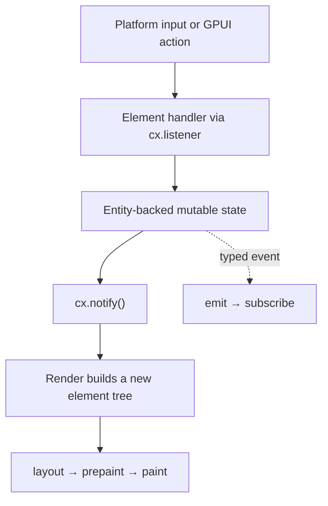

# Idiomatic Zed GPUI Reference

> Evidence-backed application-authoring patterns for Zed's GPUI at source revision `6bd93fc3195242834f4999f3b3daab294df6b253`.

## Scope and vocabulary

The framework is named **GPUI**. This file keeps `zedgpu` in its filename because that was the requested artifact name, but the code and prose use the source project’s canonical names.

This reference is for native Rust application code built with:

- `gpui` for lifecycle, entities, windows, elements, input, and tests;
- `gpui_platform` for selecting the native backend;
- Zed’s `ui` crate for semantic controls, theme tokens, spacing, labels, lists, and tooltips;
- `ui_input` when the application already initializes Zed’s editor-backed text field.

It is not a guide to implementing the AppKit, CVDisplayLink, or Metal backend. Those internals are summarized only to make the boundary clear.

The companion [`zedgpu-observations.md`](zedgpu-observations.md) is the research ledger. It lists every parsed source file and retains implementation details, caveats, and future-use notes that are not application idioms.

## The shortest useful mental model

GPUI is a hybrid immediate/retained framework. `App` retains application state in typed entities. Each render pass rebuilds a short-lived element tree. Stable entity and element identities connect those two worlds.



The practical consequences are:

1. Put long-lived mutable view state in an `Entity<T>` created with `cx.new`.
2. Mutate it only through a GPUI context.
3. Call `cx.notify()` when observers or rendering must be invalidated.
4. Build the visible tree declaratively in `Render` or `RenderOnce`.
5. Give stateful/interactive repeated elements stable, unique IDs.
6. Keep task, subscription, focus, and scroll handles in the owner whose lifetime should cancel or preserve them.

Source: [GPUI overview](/Users/amuldotexe/Desktop/oss-read-only/zed-gpui/crates/gpui/README.md:3), [ownership and data flow](/Users/amuldotexe/Desktop/oss-read-only/zed-gpui/crates/gpui/src/_ownership_and_data_flow.rs:1), [element lifecycle](/Users/amuldotexe/Desktop/oss-read-only/zed-gpui/crates/gpui/src/element.rs:1).

## Decision table

| Need | Idiomatic choice | Avoid as the default |
|---|---|---|
| Mutable screen/window state | `Entity<T>` + `Render` | Globals or callback-local mutable state |
| Reusable stateless component | `#[derive(IntoElement)]` + `RenderOnce` | A new entity for every visual fragment |
| Ordinary layout | `div`, `h_flex`, `v_flex`, semantic UI components | A custom `Element` |
| Conditional composition | `when`, `when_some`, `when_none`, `when_else`, `map` | Breaking a fluent tree into many mutable temporaries |
| User command/key binding | Namespaced `Action` + key context + `.on_action(...)` | Raw key-down handling for commands |
| Local semantic notification | `EventEmitter<E>` + `emit`/`subscribe` | Encoding event payloads in `notify()` |
| Repaint/invalidation | `cx.notify()` | Emitting a fake semantic event |
| Owner-scoped async work | Store `Task<T>` | Detaching everything |
| Fire-and-forget fallible work | `detach_and_log_err` | Silent detached errors |
| Uniform-height large list | `uniform_list` + retained `UniformListScrollHandle` | Rendering every row eagerly |
| Variable-height large list | `list` + `ListState` | Pretending rows are uniform |
| Zed-integrated single-line input | `ui_input::InputField` after editor initialization | Reimplementing IME behavior |
| Custom editor/input engine | `EntityInputHandler` + `ElementInputHandler` | Treating IME input as simple character callbacks |
| App-wide service/policy | Typed `Global`, preferably encapsulated | Using a global for local view state |
| Native desktop startup | `gpui_platform::application()` | Depending on `MacPlatform`, AppKit, or Metal in feature code |

## 1. Start through the platform selector

Use `gpui_platform::application()` and open a root `Render` entity inside `run`.

```rust
use gpui::{App, AppContext, Context, Render, Window, WindowOptions, div, prelude::*};

struct TweetScrollsRoot {
    status: &'static str,
}

impl Render for TweetScrollsRoot {
    fn render(&mut self, _window: &mut Window, _cx: &mut Context<Self>) -> impl IntoElement {
        div()
            .size_full()
            .flex()
            .items_center()
            .justify_center()
            .child(self.status)
    }
}

fn main() {
    gpui_platform::application().run(|cx: &mut App| {
        cx.open_window(WindowOptions::default(), |_window, cx| {
            cx.new(|_cx| TweetScrollsRoot { status: "Ready" })
        })
        .expect("open primary GPUI window");
    });
}
```

`application()` chooses `MacPlatform` under `target_os = "macos"`, and other backends on their targets. `open_window` creates the platform window, constructs the root entity, and performs an initial draw before returning.

If the app uses assets, configure them before `run` with `.with_assets(Assets)`. A standalone app using Zed’s `ui` layer must also initialize the settings/theme stack, load fonts, and set up the UI font. Follow the smallest pinned standalone example rather than copying the full Zed startup sequence.

Sources: [platform selection](/Users/amuldotexe/Desktop/oss-read-only/zed-gpui/crates/gpui_platform/src/gpui_platform.rs:13), [macOS selection](/Users/amuldotexe/Desktop/oss-read-only/zed-gpui/crates/gpui_platform/src/gpui_platform.rs:57), [window creation](/Users/amuldotexe/Desktop/oss-read-only/zed-gpui/crates/gpui/src/app.rs:1236), [standalone UI initialization](/Users/amuldotexe/Desktop/oss-read-only/zed-gpui/crates/component_preview/examples/component_preview.rs:31).

## 2. Make ownership explicit with entities and contexts

Create long-lived mutable state with `cx.new`. Store and pass `Entity<T>` handles rather than raw mutable references. Read or update the value through the context available at the call site.

```rust
struct ExportState {
    phase: ExportPhase,
}

let export_state = cx.new(|_cx| ExportState {
    phase: ExportPhase::Idle,
});

export_state.update(cx, |state, cx| {
    state.phase = ExportPhase::Running;
    cx.notify();
});
```

This is the core retained-state boundary. A context proves that the operation occurs inside GPUI’s update cycle and gives GPUI a place to queue effects, invalidations, subscriptions, and tasks.

Prefer a child entity when the child has independent mutable state, observers, tasks, or focus. Prefer a `RenderOnce` value when the child is only owned presentation data.

Sources: [canonical ownership guide](/Users/amuldotexe/Desktop/oss-read-only/zed-gpui/crates/gpui/src/_ownership_and_data_flow.rs:1), [`Context<T>` API](/Users/amuldotexe/Desktop/oss-read-only/zed-gpui/crates/gpui/src/app/context.rs:1).

## 3. Separate invalidation from semantic events

Use two different mechanisms for two different jobs:

- `cx.notify()` means “this entity changed; invalidate observers and its rendered subtree.”
- `cx.emit(event)` means “a typed domain event occurred.” Subscribers receive its payload.

```rust
#[derive(Clone)]
struct ExportFinished {
    output_path: std::path::PathBuf,
}

impl gpui::EventEmitter<ExportFinished> for ExportState {}

fn finish_archive_export_flow(
    &mut self,
    output_path: std::path::PathBuf,
    cx: &mut Context<Self>,
) {
    self.phase = ExportPhase::Complete;
    cx.notify();
    cx.emit(ExportFinished { output_path });
}
```

Use `observe` when the dependency is “the entity changed.” Use `subscribe` when callers care about a particular event and its data.

Sources: [`notify`](/Users/amuldotexe/Desktop/oss-read-only/zed-gpui/crates/gpui/src/app/context.rs:229), [`emit`](/Users/amuldotexe/Desktop/oss-read-only/zed-gpui/crates/gpui/src/app/context.rs:765), [`observe`](/Users/amuldotexe/Desktop/oss-read-only/zed-gpui/crates/gpui/src/app/context.rs:63), [`subscribe`](/Users/amuldotexe/Desktop/oss-read-only/zed-gpui/crates/gpui/src/app/context.rs:98), [compact event example](/Users/amuldotexe/Desktop/oss-read-only/zed-gpui/crates/gpui/examples/ownership_post.rs:14).

## 4. Match subscription lifetime to ownership

`Subscription` is `#[must_use]`. Dropping it unsubscribes.

- Store it in the observing entity when observation should end with that owner.
- Call `.detach()` only when the relationship should survive the local handle and naturally end when the participating entities or application listener set disappear.

```rust
struct ExportPanel {
    subscriptions: Vec<gpui::Subscription>,
}

fn watch_archive_export_state(
    &mut self,
    export_state: &Entity<ExportState>,
    cx: &mut Context<Self>,
) {
    self.subscriptions.push(cx.observe(export_state, |_this, _state, cx| {
        cx.notify();
    }));
}
```

Do not create a subscription in a temporary and accidentally drop it at the end of the statement. Do not detach merely to silence the `must_use` warning.

Sources: [`Subscription` and `detach`](/Users/amuldotexe/Desktop/oss-read-only/zed-gpui/crates/gpui/src/subscription.rs:149), [ownership event example](/Users/amuldotexe/Desktop/oss-read-only/zed-gpui/crates/gpui/examples/ownership_post.rs:20).

## 5. Use `Render` for stateful views and `RenderOnce` for components

`Render` takes `&mut self` and is the natural implementation for an entity-backed view. `RenderOnce` consumes `self` and is the natural implementation for a stateless component value.

```rust
#[derive(IntoElement)]
struct StatusPill {
    label: SharedString,
    color: ui::Color,
}

impl RenderOnce for StatusPill {
    fn render(self, _window: &mut Window, cx: &mut App) -> impl IntoElement {
        ui::h_flex()
            .px_2()
            .py_1()
            .rounded_md()
            .bg(self.color.color(cx))
            .child(ui::Label::new(self.label))
    }
}
```

Keep component input owned and explicit. Use builder methods for optional variants, and use four-word names for application-specific helpers when the project convention requires them. Do not introduce an entity solely because a reusable visual fragment needs a type.

Sources: [`Render` and `RenderOnce`](/Users/amuldotexe/Desktop/oss-read-only/zed-gpui/crates/gpui/src/element.rs:163), [framework component recommendation](/Users/amuldotexe/Desktop/oss-read-only/zed-gpui/crates/gpui/src/element.rs:30).

## 6. Build ordinary UI from semantic components and fluent layout

Within Zed-style application code, import `ui::prelude::*`; its source says this is what UI files “almost always” want. Start layouts with `h_flex()` and `v_flex()`. Use `Button`, `IconButton`, `Label`, `ListItem`, `Tooltip`, toggles, menus, and other semantic components before assembling equivalent controls from raw `div`s.

```rust
use ui::prelude::*;

v_flex()
    .size_full()
    .gap(DynamicSpacing::Base08.rems(cx))
    .child(Label::new("Twitter archive"))
    .child(
        Button::new("choose-archive", "Choose archive")
            .tooltip(Tooltip::for_action_title("Choose archive", &ChooseArchive))
            .on_click(cx.listener(|this, _event, window, cx| {
                this.choose_archive_input_path(window, cx);
            })),
    )
```

The semantic layer matters because it carries theme, density, disabled/selected state, keyboard hints, tooltips, and accessibility defaults:

- Use `DynamicSpacing` rather than deriving spacing manually from `ui_density`.
- Use semantic `Color` values. `Color::Custom` is an escape hatch for externally sourced colors, not ordinary theming.
- Let visible `Button` labels supply the accessible name unless the control needs a better explicit label.
- Give nearly every interactable a tooltip; use action-aware tooltips so keybinding text follows the active keymap.
- Use `ButtonLike` sparingly. Its source describes it as the escape hatch for cases where prebuilt buttons are insufficient.

Sources: [`ui` prelude](/Users/amuldotexe/Desktop/oss-read-only/zed-gpui/crates/ui/src/prelude.rs:1), [flex helpers](/Users/amuldotexe/Desktop/oss-read-only/zed-gpui/crates/ui/src/components/stack.rs:7), [spacing policy](/Users/amuldotexe/Desktop/oss-read-only/zed-gpui/crates/ui/src/styles/spacing.rs:49), [semantic color warning](/Users/amuldotexe/Desktop/oss-read-only/zed-gpui/crates/ui/src/styles/color.rs:33), [`ButtonLike` boundary](/Users/amuldotexe/Desktop/oss-read-only/zed-gpui/crates/ui/src/components/button/button_like.rs:477), [tooltip policy](/Users/amuldotexe/Desktop/oss-read-only/zed-gpui/crates/ui/src/components/button/button_like.rs:35), [button accessibility defaults](/Users/amuldotexe/Desktop/oss-read-only/zed-gpui/crates/ui/src/components/button/button.rs:420).

## 7. Keep conditional UI inside the fluent tree

Use `FluentBuilder` to express render-time variants without mutable branching around the whole tree:

```rust
v_flex()
    .gap_2()
    .when(self.is_running, |this| this.child(Label::new("Exporting…")))
    .when_some(self.error.clone(), |this, error| {
        this.child(Label::new(error).color(Color::Error))
    })
    .when_else(
        self.can_export,
        |this| this.child(self.render_enabled_export_button(window, cx)),
        |this| this.child(self.render_disabled_export_button(window, cx)),
    )
```

Use:

- `when` for a boolean refinement;
- `when_some`/`when_none` for optional data;
- `when_else` for two refinements of the same builder type;
- `map` when the transformation changes the resulting type or needs an imperative local block.

Sources: [`FluentBuilder`](/Users/amuldotexe/Desktop/oss-read-only/zed-gpui/crates/gpui/src/util.rs:11), [high-level field usage](/Users/amuldotexe/Desktop/oss-read-only/zed-gpui/crates/ui_input/src/input_field.rs:146).

## 8. Treat element IDs as functional identity

Call `.id(...)` before using stateful interaction methods such as `.on_click(...)`, roles, and ARIA properties. The ID must be stable across frames for the same logical item and unique among nodes in a frame.

```rust
v_flex().children(self.rows.iter().map(|row| {
    ListItem::new(("archive-row", row.id))
        .aria_label(row.title.clone())
        .toggle_state(row.id == self.selected_row)
        .on_click(cx.listener({
            let row_id = row.id;
            move |this, _event, _window, cx| {
                this.select_archive_thread_row(row_id, cx);
            }
        }))
}))
```

Avoid using array position as identity when rows can reorder. Prefer a domain ID. Repeated `text!` calls from the same source location need `.with_id(index)` or a unique ancestor ID because the macro otherwise derives the same accessibility identity.

Sources: [ID upgrades interaction state](/Users/amuldotexe/Desktop/oss-read-only/zed-gpui/crates/gpui/src/elements/div.rs:743), [unique global ID rule](/Users/amuldotexe/Desktop/oss-read-only/zed-gpui/crates/gpui/src/_accessibility.rs:55), [repeated text identity](/Users/amuldotexe/Desktop/oss-read-only/zed-gpui/crates/gpui/src/_accessibility.rs:121).

## 9. Use actions for commands and raw events for gestures

Declare unit commands with `actions!`. Derive `Action` for commands with payloads. Zed requires action namespaces. Bind keys during app initialization, apply a key context to the relevant subtree, track focus, and handle the action on the focused rendered element.

```rust
gpui::actions!(tweet_scrolls, [ChooseArchive, StartExport]);

fn bind_archive_action_keymap(cx: &mut App) {
    cx.bind_keys([
        KeyBinding::new("cmd-o", ChooseArchive, Some("TweetScrolls")),
        KeyBinding::new("cmd-enter", StartExport, Some("TweetScrolls")),
    ]);
}

div()
    .id("tweet-scrolls-root")
    .key_context("TweetScrolls")
    .track_focus(&self.focus_handle)
    .on_action(cx.listener(Self::handle_choose_archive_action))
    .on_action(cx.listener(Self::handle_start_export_action))
```

Use `.on_click(...)`, mouse, scroll, pinch, or drag handlers for pointer/gesture behavior. Use actions when the intent should be invokable from keyboard, menus, the command palette, tests, or accessibility-oriented command surfaces.

Event propagation has intentionally different defaults:

- ordinary event handlers propagate by default; call `cx.stop_propagation()` to stop them;
- action handlers stop during bubble by default; call `cx.propagate()` to allow a parent action handler;
- `window.prevent_default()` suppresses default behavior such as a parent taking focus on mouse-down; it does not stop propagation.

Prefer element `.on_action(...)` handlers. `Window::on_action` is a lower-level paint-phase API.

Sources: [`actions!`](/Users/amuldotexe/Desktop/oss-read-only/zed-gpui/crates/gpui/src/action.rs:24), [key bindings](/Users/amuldotexe/Desktop/oss-read-only/zed-gpui/crates/gpui/src/app.rs:2164), [key context and element actions](/Users/amuldotexe/Desktop/oss-read-only/zed-gpui/crates/gpui/src/elements/div.rs:794), [propagation defaults](/Users/amuldotexe/Desktop/oss-read-only/zed-gpui/crates/gpui/src/app.rs:2199), [`prevent_default`](/Users/amuldotexe/Desktop/oss-read-only/zed-gpui/crates/gpui/src/window.rs:2902), [low-level action warning](/Users/amuldotexe/Desktop/oss-read-only/zed-gpui/crates/gpui/src/window.rs:6045).

## 10. Retain focus and make keyboard behavior visible in the tree

Store a `FocusHandle` in a stateful view, implement `Focusable` when callers need to focus the view, and call `.track_focus(&handle)` on the interactive root during render.

```rust
struct ArchivePicker {
    focus_handle: FocusHandle,
}

impl Focusable for ArchivePicker {
    fn focus_handle(&self, _cx: &App) -> FocusHandle {
        self.focus_handle.clone()
    }
}

div()
    .id("archive-picker")
    .track_focus(&self.focus_handle)
    .tab_index(0)
    .focus_visible(|style| style.border_color(cx.theme().colors().border_focused))
```

Tab traversal is opt-in. Use `tab_index`/`tab_stop` and `tab_group` deliberately; do not assume a clickable node automatically participates in focus order. For compound controls, focus a container and use `window.focus_next(cx)`/`focus_prev(cx)` where the UX requires explicit traversal.

Sources: [focus tracking and tab APIs](/Users/amuldotexe/Desktop/oss-read-only/zed-gpui/crates/gpui/src/elements/div.rs:752), [tab-stop example](/Users/amuldotexe/Desktop/oss-read-only/zed-gpui/crates/gpui/examples/tab_stop.rs:1), [window close/focus example](/Users/amuldotexe/Desktop/oss-read-only/zed-gpui/crates/gpui/examples/on_window_close_quit.rs:12).

## 11. Design accessibility with the interaction

For every custom interactive control, provide all relevant pieces together:

- stable unique `.id(...)`;
- semantic `.role(...)`;
- accessible name through visible semantic content or `.aria_label(...)`;
- value, selected, checked/toggled, expanded, or numeric range state when applicable;
- retained focus and tab behavior;
- accessible actions for behavior not already covered by `on_click`.

```rust
div()
    .id("split-output-toggle")
    .role(gpui::Role::Switch)
    .aria_label("Split output into files under one megabyte")
    .aria_toggled(if self.split_output {
        gpui::Toggled::True
    } else {
        gpui::Toggled::False
    })
    .track_focus(&self.split_toggle_focus)
    .tab_index(0)
    .on_click(cx.listener(|this, _event, _window, cx| {
        this.split_output = !this.split_output;
        cx.notify();
    }))
```

Use semantic components whenever possible because they already coordinate several of these requirements. `on_click` registers an accessible click action; other accessible actions remain distinct from GPUI `Action` commands.

Sources: [accessibility identity and roles](/Users/amuldotexe/Desktop/oss-read-only/zed-gpui/crates/gpui/src/_accessibility.rs:55), [stateful accessibility API](/Users/amuldotexe/Desktop/oss-read-only/zed-gpui/crates/gpui/src/elements/div.rs:1246), [complete accessibility example](/Users/amuldotexe/Desktop/oss-read-only/zed-gpui/crates/gpui/examples/a11y.rs:63), [semantic list behavior](/Users/amuldotexe/Desktop/oss-read-only/zed-gpui/crates/ui/src/components/list/list_item.rs:318).

## 12. Make async ownership and cancellation intentional

Entity-scoped `cx.spawn` is the normal path for work that will return to view state. It provides a weak entity handle so the task does not keep a closed view alive. Store the returned `Task` if dropping the owner should cancel the work.

```rust
struct ExportPanel {
    export_task: Option<Task<()>>,
}

fn start_archive_export_task(
    &mut self,
    request: ExportRequest,
    cx: &mut Context<Self>,
) {
    let export_task = cx.background_spawn(async move {
        export_twitter_archive_files(request)
    });

    self.export_task = Some(cx.spawn(async move |weak_panel, async_cx| {
        let result = export_task.await;
        weak_panel
            .update(async_cx, |panel, cx| {
                panel.finish_archive_export_result(result);
                cx.notify();
            })
            .ok();
    }));
}
```

Use these rules:

- `Context::spawn`/`Window::spawn`: foreground, entity/window-scoped orchestration and UI re-entry;
- `background_spawn` or `BackgroundExecutor::spawn`: `Send + 'static` CPU/blocking-independent work off the UI thread;
- store `Task<T>`: cancellation follows the owner;
- `.detach()`: work intentionally outlives the local handle;
- `.detach_and_log_err(cx)`: fallible fire-and-forget work remains observable;
- `gpui_tokio::Tokio::spawn`: bridge a Tokio future while preserving cancellation from the GPUI task.

After an `await`, use the async context’s `update` APIs to regain synchronous mutable GPUI access. Handle a missing entity/window as a normal cancellation/lifetime outcome.

Sources: [entity-scoped spawn contract](/Users/amuldotexe/Desktop/oss-read-only/zed-gpui/crates/gpui/src/app/context.rs:235), [async update boundary](/Users/amuldotexe/Desktop/oss-read-only/zed-gpui/crates/gpui/src/app/async_context.rs:163), [background executor](/Users/amuldotexe/Desktop/oss-read-only/zed-gpui/crates/gpui/src/executor.rs:89), [error-aware detachment](/Users/amuldotexe/Desktop/oss-read-only/zed-gpui/crates/gpui/src/executor.rs:28), [Tokio cancellation](/Users/amuldotexe/Desktop/oss-read-only/zed-gpui/crates/gpui_tokio/src/gpui_tokio.rs:53), [image-loading example](/Users/amuldotexe/Desktop/oss-read-only/zed-gpui/crates/gpui/examples/image_loading.rs:1).

## 13. Choose list virtualization by measurement model

Use `uniform_list` when every item has the same height. Retain one `UniformListScrollHandle` in the view and attach it with `.track_scroll(...)` so programmatic and user scroll state survives render passes.

```rust
uniform_list(
    "archive-thread-list",
    self.threads.len(),
    cx.processor(|this, range, _window, _cx| {
        range
            .map(|index| this.render_thread_list_row(index))
            .collect()
    }),
)
.track_scroll(&self.thread_scroll_handle)
```

Use `list` plus `ListState` when row heights vary or every row needs measurement. Choose `.measure_all()` only when the cost and correctness tradeoff are understood.

The range renderer needs entity state and produces a value, so `cx.processor(...)` is the correct callback helper. Ordinary element event callbacks that mutate the view and return nothing use `cx.listener(...)`.

Sources: [`uniform_list` contract](/Users/amuldotexe/Desktop/oss-read-only/zed-gpui/crates/gpui/src/elements/uniform_list.rs:1), [scroll handle](/Users/amuldotexe/Desktop/oss-read-only/zed-gpui/crates/gpui/src/elements/uniform_list.rs:80), [range renderer example](/Users/amuldotexe/Desktop/oss-read-only/zed-gpui/crates/gpui/examples/uniform_list.rs:1), [variable-height `ListState`](/Users/amuldotexe/Desktop/oss-read-only/zed-gpui/crates/gpui/examples/list_example.rs:13), [`listener` and `processor`](/Users/amuldotexe/Desktop/oss-read-only/zed-gpui/crates/gpui/src/app/context.rs:252).

## 14. Use the right text-input layer

For a Zed-integrated application that initializes the editor subsystem, use `ui_input::InputField` for single-line form/search fields. It already coordinates:

- placeholder and label;
- focus handle, tab stop, and tab index;
- semantic editor colors and focus/error borders;
- leading icon;
- masked content with an accessible tooltip-backed reveal button;
- validation message;
- text getters/setters and editor event subscription.

```rust
let archive_name_field = cx.new(|cx| {
    InputField::new(window, cx, "tweet-scrolls-2026-08-12")
        .label("Output folder name")
        .tab_index(0)
        .tab_stop(true)
});
```

Important dependency note: `InputField` wraps Zed’s editor and reads `ERASED_EDITOR_FACTORY`. The editor initialization installs this factory. It is not a zero-dependency bare-GPUI text box.

Only implement `EntityInputHandler` for a genuinely custom editor/input engine. That path requires correct UTF-16 selections, marked/composing text, replacement, character hit testing, and range geometry for the platform IME candidate window. Register its `ElementInputHandler` during paint with the element bounds.

Sources: [`InputField`](/Users/amuldotexe/Desktop/oss-read-only/zed-gpui/crates/ui_input/src/input_field.rs:17), [editor dependency/factory](/Users/amuldotexe/Desktop/oss-read-only/zed-gpui/crates/ui_input/src/ui_input.rs:1), [factory initialization](/Users/amuldotexe/Desktop/oss-read-only/zed-gpui/crates/editor/src/editor.rs:394), [`EntityInputHandler`](/Users/amuldotexe/Desktop/oss-read-only/zed-gpui/crates/gpui/src/input.rs:4), [platform IME contract](/Users/amuldotexe/Desktop/oss-read-only/zed-gpui/crates/gpui/src/platform.rs:1651).

## 15. Reserve globals for application-wide state

Implement `Global` for services or policy that truly belong to the entire application: theme/settings stores, clients, clocks, factories, or cross-window registries. Keep screen-local state in entities.

```rust
use gpui::{ReadGlobal, UpdateGlobal};

struct GlobalExportPolicy {
    split_threshold_bytes: u64,
}

impl gpui::Global for GlobalExportPolicy {}

impl GlobalExportPolicy {
    fn install_global_export_policy(cx: &mut App, split_threshold_bytes: u64) {
        Self::set_global(cx, Self { split_threshold_bytes });
    }

    fn read_export_split_threshold(cx: &App) -> u64 {
        Self::global(cx).split_threshold_bytes
    }
}
```

If callers should not have arbitrary read/write access, make the global marker type private and expose a narrow wrapper API. This encapsulation technique is recommended directly by the framework documentation.

Sources: [`Global` and access restriction](/Users/amuldotexe/Desktop/oss-read-only/zed-gpui/crates/gpui/src/global.rs:3), [typed read/update helpers](/Users/amuldotexe/Desktop/oss-read-only/zed-gpui/crates/gpui/src/global.rs:28).

## 16. Load assets through the application and animate declaratively

Install one `AssetSource` on the application with `.with_assets(...)`. Resolve render-time assets through GPUI (`window.use_asset`, `img`, or the relevant semantic component) so loading, cache invalidation, fallback content, and errors participate in the framework lifecycle.

```rust
gpui_platform::application()
    .with_assets(Assets)
    .run(|cx| {
        // Initialize and open the application.
    });

img(move |window: &mut Window, cx: &mut App| {
    window.use_asset::<ArchivePreviewAsset>(&preview_source, cx)
})
.id(("archive-preview", preview_id))
.with_loading(|| render_preview_loading_state().into_any_element())
.with_fallback(|| render_preview_failure_state().into_any_element())
```

Use `.with_animation(...)` for a render-time visual animation with an explicit name, duration, repeat policy, easing function, and style transformation. Keep domain state changes in entities; an animation is not a replacement for the application state machine.

For asynchronous custom assets, implement `Asset::load` as a `Send + 'static` future that returns renderable data or a typed cache error. Do not block the UI thread while reading or decoding.

Sources: [asset source and application setup](/Users/amuldotexe/Desktop/oss-read-only/zed-gpui/crates/gpui/examples/image_loading.rs:1), [asset loading/fallbacks](/Users/amuldotexe/Desktop/oss-read-only/zed-gpui/crates/gpui/examples/image_loading.rs:122), [declarative animation](/Users/amuldotexe/Desktop/oss-read-only/zed-gpui/crates/gpui/examples/animation.rs:76).

## 17. Keep window lifecycle explicit

Opening, focusing, closing, and quitting are separate policies. Configure `WindowOptions` deliberately. If the product should quit when the last window closes, register `on_window_closed` and check the remaining windows instead of assuming all platforms share that behavior.

```rust
fn install_application_window_lifecycle(cx: &mut App) {
    cx.on_window_closed(|cx, _window_id| {
        if cx.windows().is_empty() {
            cx.quit();
        }
    })
    .detach();
}
```

An entity can render in more than one window. Helpers that find a window for an entity use its most recently rendered window; that is a convenience, not permanent window ownership.

Sources: [multi-window close/quit example](/Users/amuldotexe/Desktop/oss-read-only/zed-gpui/crates/gpui/examples/on_window_close_quit.rs:44), [`on_window_closed`](/Users/amuldotexe/Desktop/oss-read-only/zed-gpui/crates/gpui/src/app.rs:2309), [entity/window lookup](/Users/amuldotexe/Desktop/oss-read-only/zed-gpui/crates/gpui/src/app.rs:1784).

## 18. Test behavior through GPUI’s deterministic harness

Use `#[gpui::test]` with `TestAppContext`. For UI behavior, open a window and create `VisualTestContext::from_window`; actions and event handlers exist in the rendered tree, so draw before driving interactions that depend on it.

```rust
#[gpui::test]
fn exports_archive_from_action(cx: &mut TestAppContext) {
    let window = cx.update(|cx| {
        cx.open_window(WindowOptions::default(), |_window, cx| {
            cx.new(|cx| TweetScrollsRoot::create_initial_root_view(cx))
        })
        .unwrap()
    });
    let mut cx = VisualTestContext::from_window(window.into(), cx);
    let root = window.root(&mut cx).unwrap();

    let focus_handle = root.read_with(&cx, |root, _cx| root.focus_handle.clone());
    cx.update(|window, cx| {
        focus_handle.dispatch_action(&StartExport, window, cx);
    });
    cx.run_until_parked();

    root.read_with(&cx, |root, cx| {
        assert_eq!(root.read_current_export_phase(), ExportPhase::Complete);
        assert!(root.read_generated_output_path(cx).is_some());
    });
}
```

Test at three layers:

1. Pure Rust unit tests for formatting, chunking, naming, and filesystem-independent decisions.
2. Entity tests for state transitions, notifications, and emitted events.
3. Visual GPUI tests for rendered actions, focus, keyboard, mouse, prompts, file selection, resize, and accessibility-relevant interaction paths.

The test executor is deterministic and single-threaded. Synchronous context updates flush effects. Detached asynchronous work needs executor progress such as `run_until_parked`. Await owned tasks directly. Mock external I/O; use `allow_parking()` only when parking is a deliberate part of the test.

Sources: [test determinism](/Users/amuldotexe/Desktop/oss-read-only/zed-gpui/crates/gpui/src/test.rs:1), [test contexts](/Users/amuldotexe/Desktop/oss-read-only/zed-gpui/crates/gpui/src/app/test_context.rs:18), [visual test construction](/Users/amuldotexe/Desktop/oss-read-only/zed-gpui/crates/gpui/examples/testing.rs:248), [async draining and parking](/Users/amuldotexe/Desktop/oss-read-only/zed-gpui/crates/gpui/examples/testing.rs:278), [input simulation](/Users/amuldotexe/Desktop/oss-read-only/zed-gpui/crates/gpui/src/app/test_context.rs:494).

## 19. Escalate to a custom `Element` only for manual layout or paint

Ordinary components should use `RenderOnce` and `IntoElement`. Implement `Element` only when the component truly needs manual layout, hitbox/prepaint work, direct painting, or specialized performance behavior such as an editor or canvas.

A custom element must respect this lifecycle:

1. `request_layout`: register layout and return request-layout state;
2. `prepaint`: inspect computed bounds, insert hitboxes, prepare paint state;
3. `paint`: draw primitives and register paint-time behavior.

If it retains state or contributes accessibility, give it stable identity and implement the accessibility node/action path deliberately. Do not hide ordinary application state inside the ephemeral element value.

For a measured expensive subtree with a definite size, `Entity::cached`/`AnyView::cached` can recycle layout and paint work until the entity notifies. Treat it as an optimization: `cx.notify()` invalidates the cached backing entity and `Window::refresh()` deliberately bypasses cached reuse. Do not cache a subtree whose size must be inferred from its contents.

Sources: [custom-element escalation rule](/Users/amuldotexe/Desktop/oss-read-only/zed-gpui/crates/gpui/src/element.rs:30), [`Element` phases](/Users/amuldotexe/Desktop/oss-read-only/zed-gpui/crates/gpui/src/element.rs:47), [manual painting example](/Users/amuldotexe/Desktop/oss-read-only/zed-gpui/crates/gpui/examples/painting.rs:1), [cached-view contract](/Users/amuldotexe/Desktop/oss-read-only/zed-gpui/crates/gpui/src/view.rs:34).

## 20. Keep the macOS backend behind GPUI

Application code should stop at `gpui_platform::application()`, `WindowOptions`, GPUI elements, and platform-neutral scenes.

Internally on macOS:

- `MacPlatform::open_window` translates GPUI window parameters to AppKit;
- visible windows subscribe to a display-specific frame source;
- one immortal `CVDisplayLink` per display avoids unsafe CoreVideo teardown races;
- callbacks coalesce frame requests onto the main queue rather than mutating UI state off-thread;
- `MetalRenderer` consumes GPUI’s `Scene` and presents the drawable;
- test support can render offscreen and read textures.

This is confirmation that feature code should not own AppKit windows, manage CVDisplayLink, submit Metal command buffers, or add macOS conditionals for ordinary UI behavior.

Sources: [macOS platform window adapter](/Users/amuldotexe/Desktop/oss-read-only/zed-gpui/crates/gpui_macos/src/platform.rs:642), [window display-link subscription](/Users/amuldotexe/Desktop/oss-read-only/zed-gpui/crates/gpui_macos/src/window.rs:670), [display-link lifetime design](/Users/amuldotexe/Desktop/oss-read-only/zed-gpui/crates/gpui_macos/src/display_link.rs:1), [Metal scene presentation](/Users/amuldotexe/Desktop/oss-read-only/zed-gpui/crates/gpui_macos/src/metal_renderer.rs:447).

## Common failure modes

| Failure | Why it fails | Better pattern |
|---|---|---|
| Mutate view state but omit `cx.notify()` | Render/observers may remain stale | Notify after invalidating state changes |
| Use `notify()` as a domain event | No typed payload or semantic contract | `emit`/`subscribe` |
| Drop a `Subscription` temporary | Drop unsubscribes immediately | Store it or detach intentionally |
| Drop a live `Task` accidentally | Drop cancels unfinished work | Store it in the owner |
| Detach every task | Work can outlive UI and errors disappear | Own tasks; use error-aware detachment selectively |
| Repeat the same element ID | State/a11y nodes collide | Stable unique domain IDs |
| Use raw colors/spacing everywhere | Breaks theme and density consistency | Semantic `Color` + `DynamicSpacing` |
| Build a button from raw `div` | Recreates focus, keyboard, disabled, tooltip, and a11y behavior | `Button`/`IconButton` |
| Handle commands in raw key-down callbacks | Bypasses keymaps, contexts, menus, and action tests | Namespaced actions |
| Assume click implies keyboard focus | Tab participation is explicit | Retain focus, track it, configure tab order |
| Use `uniform_list` for variable rows | Its measurement model assumes uniform height | `list` + `ListState` |
| Construct `ui_input::InputField` before editor init | Erased editor factory is absent | Initialize editor or choose another input layer |
| Implement text input as `String` insertion only | IME requires UTF-16 selection, marked text, and geometry | Full `EntityInputHandler` contract |
| Put screen-local state in `Global` | Hides ownership and couples windows | Entity-local state |
| Implement `Element` for ordinary layout | Adds lifecycle/paint complexity without benefit | `RenderOnce` composition |
| Touch AppKit/Metal in a feature | Couples logic to backend internals | GPUI platform abstractions |

## Pre-commit review checklist

- [ ] Mutable UI state has a clear owning entity.
- [ ] Every state change that affects rendering or observers calls `cx.notify()`.
- [ ] Semantic events use typed `emit`/`subscribe`.
- [ ] Subscription and task storage matches the desired cancellation lifetime.
- [ ] Detached fallible tasks log errors.
- [ ] Stateful/repeated elements have stable unique IDs.
- [ ] Commands are actions with appropriate key contexts.
- [ ] Focus handles are retained, tracked in render, and included in deliberate tab order.
- [ ] Custom controls have roles, names, state/value, keyboard behavior, and accessible actions.
- [ ] Zed semantic components, colors, spacing, and action-aware tooltips are used before escape hatches.
- [ ] Virtualized list type matches row-height behavior and scroll handles are retained.
- [ ] `ui_input` is initialized before use, or custom input implements the full IME boundary.
- [ ] Async background work returns plain data and re-enters GPUI through `update`.
- [ ] Tests drive a rendered tree and explicitly advance detached async work.
- [ ] Custom `Element`, global state, and platform-specific code each have a concrete reason to exist.

## Evidence boundary

This reference is pinned to Zed revision `6bd93fc3195242834f4999f3b3daab294df6b253`. GPUI is pre-1.0 and its own README warns that its API changes frequently. Re-verify source links and signatures when updating the Zed revision.

The complete evidence ledger, including directly read spans and non-prescriptive backend details, is in [`zedgpu-observations.md`](zedgpu-observations.md).
